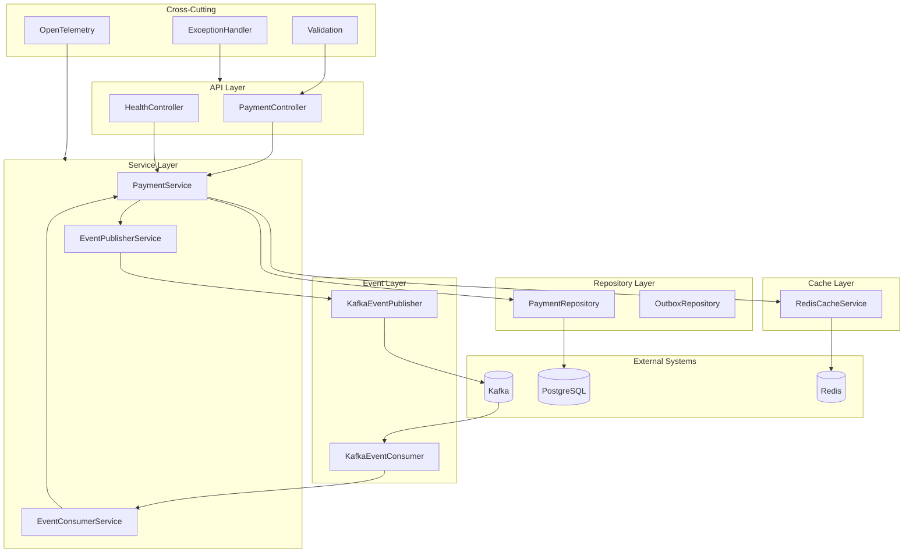
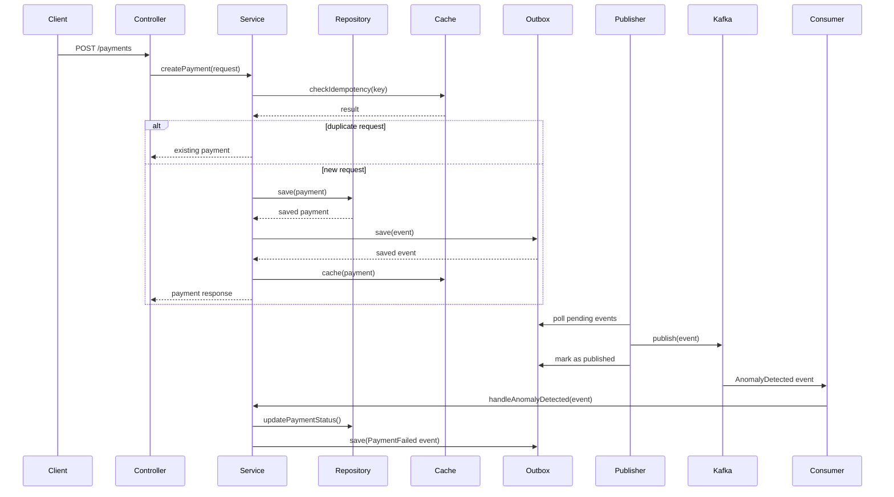
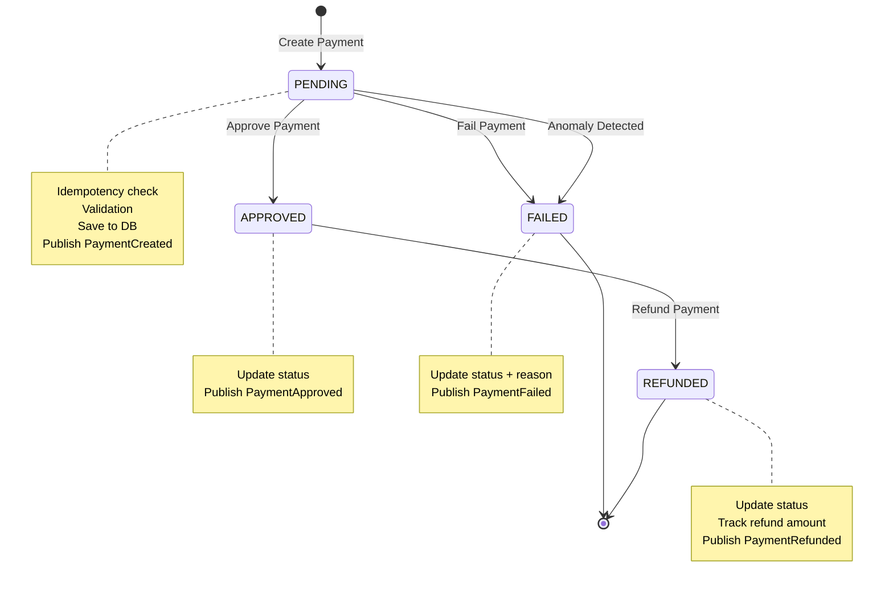
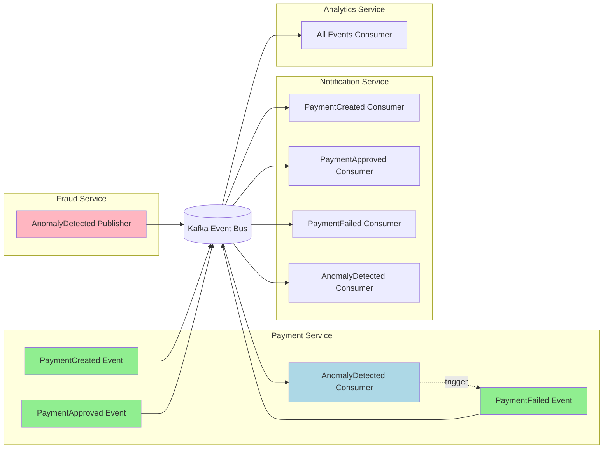
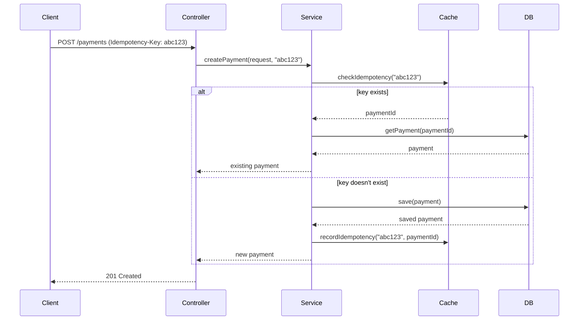

# Payment Service Design Document

## Table of Contents
1. [Architecture Overview](#1-architecture-overview)
2. [Component Design](#2-component-design)
3. [API Design](#3-api-design)
4. [Data Model Design](#4-data-model-design)
5. [Event Design](#5-event-design)
6. [Error Handling Strategy](#6-error-handling-strategy)
7. [Validation Strategy](#7-validation-strategy)
8. [Idempotency Strategy](#8-idempotency-strategy)
9. [Caching Strategy](#9-caching-strategy)
10. [Configuration Strategy](#10-configuration-strategy)
11. [Dependencies to Add](#11-dependencies-to-add)
12. [Implementation Phases](#12-implementation-phases)

---

## 1. Architecture Overview

### 1.1 Overall Service Architecture

The Payment Service follows a layered architecture pattern with event-driven communication:



### 1.2 Component Interaction Diagram



### 1.3 Payment Lifecycle Data Flow



### 1.4 Event Flow Diagram



---

## 2. Component Design

### 2.1 Controllers

#### PaymentController
**Purpose:** REST API endpoints for payment operations

**Dependencies:**
- PaymentService
- Request validation annotations

**Key Methods:**
- `createPayment(@RequestBody CreatePaymentRequest request, @RequestHeader(value = "Idempotency-Key", required = false) String idempotencyKey)` - Creates a new payment
- `getAllPayments(@RequestParam(defaultValue = "0") int page, @RequestParam(defaultValue = "20") int size)` - Lists all payments with pagination
- `getPaymentById(@PathVariable UUID id)` - Gets a payment by ID
- `approvePayment(@PathVariable UUID id)` - Approves a payment
- `failPayment(@PathVariable UUID id, @RequestBody FailPaymentRequest request)` - Fails a payment with reason
- `refundPayment(@PathVariable UUID id, @RequestBody RefundPaymentRequest request)` - Refunds a payment
- `getPaymentsByAccount(@PathVariable UUID accountId, @RequestParam(defaultValue = "0") int page, @RequestParam(defaultValue = "20") int size)` - Gets payments by account
- `getPaymentsByStatus(@PathVariable PaymentStatus status, @RequestParam(defaultValue = "0") int page, @RequestParam(defaultValue = "20") int size)` - Gets payments by status

**Integration Points:**
- Receives HTTP requests from clients
- Delegates to PaymentService for business logic

#### HealthController
**Purpose:** Health check endpoint for monitoring

**Dependencies:** None

**Key Methods:**
- `healthCheck()` - Returns service health status

**Integration Points:**
- Monitored by infrastructure tools (Prometheus, Kubernetes)

### 2.2 Service Layer

#### PaymentService
**Purpose:** Core business logic for payment operations

**Dependencies:**
- PaymentRepository
- OutboxRepository
- RedisCacheService
- EventPublisherService
- PaymentMapper

**Key Methods:**
- `createPayment(CreatePaymentRequest request, String idempotencyKey)` - Creates a new payment with idempotency check
- `approvePayment(UUID id)` - Approves a payment
- `failPayment(UUID id, String reason)` - Fails a payment with reason
- `refundPayment(UUID id, BigDecimal refundAmount)` - Refunds a payment
- `getPaymentById(UUID id)` - Gets a payment by ID (with cache)
- `getAllPayments(Pageable pageable)` - Gets all payments with pagination
- `getPaymentsByAccount(UUID accountId, Pageable pageable)` - Gets payments by account
- `getPaymentsByStatus(PaymentStatus status, Pageable pageable)` - Gets payments by status
- `handleAnomalyDetected(AnomalyDetectedEvent event)` - Handles anomaly detection events

**Integration Points:**
- Persists data via repositories
- Caches data via RedisCacheService
- Publishes events via EventPublisherService
- Maps DTOs via PaymentMapper

#### EventPublisherService
**Purpose:** Manages event publishing with outbox pattern

**Dependencies:**
- OutboxRepository
- KafkaEventPublisher
- TransactionTemplate

**Key Methods:**
- `publishPaymentCreated(Payment payment)` - Publishes PaymentCreated event
- `publishPaymentApproved(UUID paymentId)` - Publishes PaymentApproved event
- `publishPaymentFailed(UUID paymentId, String reason)` - Publishes PaymentFailed event
- `publishPaymentRefunded(UUID paymentId, BigDecimal refundAmount)` - Publishes PaymentRefunded event
- `processOutboxEvents()` - Processes pending outbox events (scheduled)

**Integration Points:**
- Saves events to outbox table
- Publishes events to Kafka
- Runs scheduled task to process outbox

#### EventConsumerService
**Purpose:** Consumes events from Kafka

**Dependencies:**
- PaymentService
- KafkaEventConsumer

**Key Methods:**
- `consumeAnomalyDetected(AnomalyDetectedEvent event)` - Consumes AnomalyDetected events

**Integration Points:**
- Listens to Kafka topics
- Delegates to PaymentService for handling

#### RedisCacheService
**Purpose:** Manages Redis caching operations

**Dependencies:**
- RedisTemplate<String, Object>

**Key Methods:**
- `getPayment(UUID id)` - Gets cached payment
- `cachePayment(Payment payment)` - Caches a payment
- `invalidatePayment(UUID id)` - Invalidates cached payment
- `checkIdempotency(String key)` - Checks if idempotency key exists
- `recordIdempotency(String key, UUID paymentId)` - Records idempotency key

**Integration Points:**
- Interacts with Redis
- Used by PaymentService for caching and idempotency

### 2.3 Repository Layer

#### PaymentRepository
**Purpose:** Data access for Payment entity

**Dependencies:**
- JpaRepository<Payment, UUID>

**Key Methods:**
- `findById(UUID id)` - Find payment by ID (inherited)
- `findAll(Pageable pageable)` - Find all payments with pagination (inherited)
- `findByFromAccountId(UUID accountId, Pageable pageable)` - Find payments by from account
- `findByToAccountId(UUID accountId, Pageable pageable)` - Find payments by to account
- `findByStatus(PaymentStatus status, Pageable pageable)` - Find payments by status
- `findByFromAccountIdOrToAccountId(UUID fromAccountId, UUID toAccountId, Pageable pageable)` - Find payments by either account

**Integration Points:**
- Interacts with PostgreSQL database

#### OutboxRepository
**Purpose:** Data access for Outbox event entity

**Dependencies:**
- JpaRepository<OutboxEvent, UUID>

**Key Methods:**
- `save(OutboxEvent event)` - Save outbox event (inherited)
- `findByStatus(OutboxStatus status, Pageable pageable)` - Find events by status
- `deleteById(UUID id)` - Delete processed event (inherited)

**Integration Points:**
- Interacts with PostgreSQL database

### 2.4 Event Publisher (Kafka Producer)

#### KafkaEventPublisher
**Purpose:** Publishes events to Kafka topics

**Dependencies:**
- KafkaTemplate<String, String>
- ObjectMapper

**Key Methods:**
- `publish(String topic, String key, Object event)` - Publishes event to Kafka topic
- `publishPaymentCreated(PaymentCreatedEvent event)` - Publishes PaymentCreated event
- `publishPaymentApproved(PaymentApprovedEvent event)` - Publishes PaymentApproved event
- `publishPaymentFailed(PaymentFailedEvent event)` - Publishes PaymentFailed event

**Integration Points:**
- Publishes to Kafka broker

### 2.5 Event Consumer (Kafka Consumer)

#### KafkaEventConsumer
**Purpose:** Consumes events from Kafka topics

**Dependencies:**
- EventConsumerService
- ObjectMapper

**Key Methods:**
- `consumeAnomalyDetected(String message)` - Consumes AnomalyDetected events

**Integration Points:**
- Listens to Kafka topics
- Delegates to EventConsumerService

### 2.6 DTOs (Request/Response Objects)

#### CreatePaymentRequest
**Purpose:** Request DTO for creating a payment

**Fields:**
- `fromAccountId: UUID` - Source account ID
- `toAccountId: UUID` - Destination account ID
- `amount: BigDecimal` - Payment amount
- `currency: String` - Currency code (ISO 4217)

**Validation:**
- `@NotNull` on all fields
- `@Positive` on amount
- `@Size(min=3, max=3)` on currency

#### PaymentResponse
**Purpose:** Response DTO for payment data

**Fields:**
- `id: UUID` - Payment ID
- `fromAccountId: UUID` - Source account ID
- `toAccountId: UUID` - Destination account ID
- `amount: BigDecimal` - Payment amount
- `currency: String` - Currency code
- `status: PaymentStatus` - Payment status
- `createdAt: Instant` - Creation timestamp
- `updatedAt: Instant` - Last update timestamp
- `failureReason: String` - Failure reason (if failed)
- `refundAmount: BigDecimal` - Refund amount (if refunded)

#### FailPaymentRequest
**Purpose:** Request DTO for failing a payment

**Fields:**
- `reason: String` - Failure reason

**Validation:**
- `@NotBlank` on reason

#### RefundPaymentRequest
**Purpose:** Request DTO for refunding a payment

**Fields:**
- `refundAmount: BigDecimal` - Refund amount

**Validation:**
- `@NotNull` on refundAmount
- `@Positive` on refundAmount

#### ErrorResponse
**Purpose:** Response DTO for errors

**Fields:**
- `timestamp: Instant` - Error timestamp
- `status: int` - HTTP status code
- `error: String` - Error type
- `message: String` - Error message
- `path: String` - Request path
- `details: List<String>` - Additional error details

### 2.7 Exception Handling

#### GlobalExceptionHandler
**Purpose:** Centralized exception handling

**Dependencies:** None

**Key Methods:**
- `handlePaymentNotFoundException(PaymentNotFoundException ex)` - Handles payment not found
- `handleInvalidPaymentStatusException(InvalidPaymentStatusException ex)` - Handles invalid status transitions
- `handleDuplicatePaymentException(DuplicatePaymentException ex)` - Handles duplicate payments
- `handleValidationException(MethodArgumentNotValidException ex)` - Handles validation errors
- `handleGenericException(Exception ex)` - Handles generic exceptions

**Integration Points:**
- Intercepts all exceptions thrown by controllers

### 2.8 Validation Layer

#### Custom Validators
**Purpose:** Custom validation logic

**Validators:**
- `@ValidCurrency` - Validates ISO 4217 currency codes
- `@ValidAccountId` - Validates account ID format
- `@ValidAmount` - Validates payment amount (min/max values)

**Integration Points:**
- Applied to DTO fields

### 2.9 Configuration Classes

#### KafkaConfig
**Purpose:** Kafka producer and consumer configuration

**Dependencies:**
- KafkaProperties

**Key Beans:**
- `kafkaTemplate()` - Kafka template for publishing
- `producerFactory()` - Producer factory
- `consumerFactory()` - Consumer factory
- `kafkaListenerContainerFactory()` - Listener container factory

**Integration Points:**
- Configures Kafka connection

#### RedisConfig (Existing)
**Purpose:** Redis configuration

**Dependencies:** None

**Key Beans:**
- `redisConnectionFactory()` - Redis connection factory
- `redisTemplate()` - Redis template

**Integration Points:**
- Configures Redis connection

#### OpenTelemetryConfig
**Purpose:** OpenTelemetry tracing configuration

**Dependencies:**
- OpenTelemetry

**Key Beans:**
- `openTelemetry()` - OpenTelemetry instance
- `tracingHandlerInterceptor()` - Tracing interceptor

**Integration Points:**
- Configures distributed tracing

#### ValidationConfig
**Purpose:** Validation configuration

**Dependencies:**
- Validator

**Key Beans:**
- `validator()` - Validator instance
- `messageSource()` - Internationalization messages

**Integration Points:**
- Configures validation

---

## 3. API Design

### 3.1 Endpoint Specifications

#### POST /payments
**Purpose:** Create a new payment

**Request Headers:**
- `Content-Type: application/json`
- `Idempotency-Key: <string>` (optional, recommended for idempotency)

**Request Body:**
```json
{
  "fromAccountId": "550e8400-e29b-41d4-a716-446655440000",
  "toAccountId": "660e8400-e29b-41d4-a716-446655440001",
  "amount": 120.50,
  "currency": "USD"
}
```

**Response (201 Created):**
```json
{
  "id": "770e8400-e29b-41d4-a716-446655440002",
  "fromAccountId": "550e8400-e29b-41d4-a716-446655440000",
  "toAccountId": "660e8400-e29b-41d4-a716-446655440001",
  "amount": 120.50,
  "currency": "USD",
  "status": "PENDING",
  "createdAt": "2026-02-07T07:34:52.133Z",
  "updatedAt": "2026-02-07T07:34:52.133Z",
  "failureReason": null,
  "refundAmount": null
}
```

**Response (409 Conflict - Duplicate):**
```json
{
  "timestamp": "2026-02-07T07:34:52.133Z",
  "status": 409,
  "error": "Conflict",
  "message": "Payment already processed with this idempotency key",
  "path": "/payments",
  "details": []
}
```

**Validation Rules:**
- `fromAccountId`: Required, valid UUID
- `toAccountId`: Required, valid UUID, different from fromAccountId
- `amount`: Required, positive, max 1,000,000
- `currency`: Required, valid ISO 4217 code (3 uppercase letters)

---

#### GET /payments
**Purpose:** List all payments with pagination

**Request Parameters:**
- `page` (optional, default: 0) - Page number
- `size` (optional, default: 20) - Page size (max 100)

**Response (200 OK):**
```json
{
  "content": [
    {
      "id": "770e8400-e29b-41d4-a716-446655440002",
      "fromAccountId": "550e8400-e29b-41d4-a716-446655440000",
      "toAccountId": "660e8400-e29b-41d4-a716-446655440001",
      "amount": 120.50,
      "currency": "USD",
      "status": "PENDING",
      "createdAt": "2026-02-07T07:34:52.133Z",
      "updatedAt": "2026-02-07T07:34:52.133Z",
      "failureReason": null,
      "refundAmount": null
    }
  ],
  "pageable": {
    "pageNumber": 0,
    "pageSize": 20,
    "totalPages": 5,
    "totalElements": 100,
    "first": true,
    "last": false
  }
}
```

---

#### GET /payments/{id}
**Purpose:** Get a payment by ID

**Path Parameters:**
- `id` - Payment UUID

**Response (200 OK):**
```json
{
  "id": "770e8400-e29b-41d4-a716-446655440002",
  "fromAccountId": "550e8400-e29b-41d4-a716-446655440000",
  "toAccountId": "660e8400-e29b-41d4-a716-446655440001",
  "amount": 120.50,
  "currency": "USD",
  "status": "PENDING",
  "createdAt": "2026-02-07T07:34:52.133Z",
  "updatedAt": "2026-02-07T07:34:52.133Z",
  "failureReason": null,
  "refundAmount": null
}
```

**Response (404 Not Found):**
```json
{
  "timestamp": "2026-02-07T07:34:52.133Z",
  "status": 404,
  "error": "Not Found",
  "message": "Payment not found with id: 770e8400-e29b-41d4-a716-446655440002",
  "path": "/payments/770e8400-e29b-41d4-a716-446655440002",
  "details": []
}
```

---

#### PUT /payments/{id}/approve
**Purpose:** Approve a payment

**Path Parameters:**
- `id` - Payment UUID

**Response (200 OK):**
```json
{
  "id": "770e8400-e29b-41d4-a716-446655440002",
  "fromAccountId": "550e8400-e29b-41d4-a716-446655440000",
  "toAccountId": "660e8400-e29b-41d4-a716-446655440001",
  "amount": 120.50,
  "currency": "USD",
  "status": "APPROVED",
  "createdAt": "2026-02-07T07:34:52.133Z",
  "updatedAt": "2026-02-07T07:35:00.000Z",
  "failureReason": null,
  "refundAmount": null
}
```

**Response (400 Bad Request - Invalid Status):**
```json
{
  "timestamp": "2026-02-07T07:34:52.133Z",
  "status": 400,
  "error": "Bad Request",
  "message": "Cannot approve payment with status: FAILED",
  "path": "/payments/770e8400-e29b-41d4-a716-446655440002/approve",
  "details": []
}
```

**Response (404 Not Found):** Same as GET /payments/{id}

---

#### PUT /payments/{id}/fail
**Purpose:** Fail a payment with reason

**Path Parameters:**
- `id` - Payment UUID

**Request Body:**
```json
{
  "reason": "INSUFFICIENT_FUNDS"
}
```

**Response (200 OK):**
```json
{
  "id": "770e8400-e29b-41d4-a716-446655440002",
  "fromAccountId": "550e8400-e29b-41d4-a716-446655440000",
  "toAccountId": "660e8400-e29b-41d4-a716-446655440001",
  "amount": 120.50,
  "currency": "USD",
  "status": "FAILED",
  "createdAt": "2026-02-07T07:34:52.133Z",
  "updatedAt": "2026-02-07T07:35:00.000Z",
  "failureReason": "INSUFFICIENT_FUNDS",
  "refundAmount": null
}
```

**Validation Rules:**
- `reason`: Required, not blank, max 255 characters

---

#### POST /payments/{id}/refund
**Purpose:** Refund a payment

**Path Parameters:**
- `id` - Payment UUID

**Request Body:**
```json
{
  "refundAmount": 120.50
}
```

**Response (200 OK):**
```json
{
  "id": "770e8400-e29b-41d4-a716-446655440002",
  "fromAccountId": "550e8400-e29b-41d4-a716-446655440000",
  "toAccountId": "660e8400-e29b-41d4-a716-446655440001",
  "amount": 120.50,
  "currency": "USD",
  "status": "REFUNDED",
  "createdAt": "2026-02-07T07:34:52.133Z",
  "updatedAt": "2026-02-07T07:35:00.000Z",
  "failureReason": null,
  "refundAmount": 120.50
}
```

**Validation Rules:**
- `refundAmount`: Required, positive, less than or equal to original amount

---

#### GET /payments/account/{accountId}
**Purpose:** Get payments by account ID

**Path Parameters:**
- `accountId` - Account UUID

**Query Parameters:**
- `page` (optional, default: 0) - Page number
- `size` (optional, default: 20) - Page size (max 100)

**Response (200 OK):** Same as GET /payments

---

#### GET /payments/status/{status}
**Purpose:** Filter payments by status

**Path Parameters:**
- `status` - Payment status (PENDING, APPROVED, FAILED, REFUNDED)

**Query Parameters:**
- `page` (optional, default: 0) - Page number
- `size` (optional, default: 20) - Page size (max 100)

**Response (200 OK):** Same as GET /payments

---

### 3.2 Status Code Mappings

| Status Code | Usage |
|-------------|-------|
| 200 OK | Successful GET, PUT operations |
| 201 Created | Successful POST operation |
| 400 Bad Request | Validation errors, invalid state transitions |
| 404 Not Found | Resource not found |
| 409 Conflict | Duplicate idempotency key |
| 500 Internal Server Error | Unexpected server errors |
| 503 Service Unavailable | Service dependencies unavailable |

---

## 4. Data Model Design

### 4.1 Payment Entity

```java
@Entity
@Table(name = "payments", indexes = {
    @Index(name = "idx_from_account", columnList = "from_account_id"),
    @Index(name = "idx_to_account", columnList = "to_account_id"),
    @Index(name = "idx_status", columnList = "status"),
    @Index(name = "idx_created_at", columnList = "created_at"),
    @Index(name = "idx_idempotency_key", columnList = "idempotency_key", unique = true)
})
public class Payment {
    
    @Id
    @GeneratedValue(strategy = GenerationType.UUID)
    private UUID id;
    
    @Column(name = "from_account_id", nullable = false)
    private UUID fromAccountId;
    
    @Column(name = "to_account_id", nullable = false)
    private UUID toAccountId;
    
    @Column(nullable = false, precision = 19, scale = 4)
    private BigDecimal amount;
    
    @Column(nullable = false, length = 3)
    private String currency;
    
    @Enumerated(EnumType.STRING)
    @Column(nullable = false, length = 20)
    private PaymentStatus status;
    
    @Column(name = "created_at", nullable = false, updatable = false)
    private Instant createdAt = Instant.now();
    
    @Column(name = "updated_at", nullable = false)
    private Instant updatedAt = Instant.now();
    
    @Column(name = "failure_reason", length = 255)
    private String failureReason;
    
    @Column(name = "refund_amount", precision = 19, scale = 4)
    private BigDecimal refundAmount;
    
    @Column(name = "idempotency_key", length = 255, unique = true)
    private String idempotencyKey;
    
    @PreUpdate
    protected void onUpdate() {
        this.updatedAt = Instant.now();
    }
    
    @PrePersist
    protected void onCreate() {
        this.createdAt = Instant.now();
        this.updatedAt = Instant.now();
    }
}
```

### 4.2 PaymentStatus Enum

```java
public enum PaymentStatus {
    PENDING,
    APPROVED,
    FAILED,
    REFUNDED
}
```

### 4.3 OutboxEvent Entity

```java
@Entity
@Table(name = "outbox_events", indexes = {
    @Index(name = "idx_status", columnList = "status"),
    @Index(name = "idx_created_at", columnList = "created_at")
})
public class OutboxEvent {
    
    @Id
    @GeneratedValue(strategy = GenerationType.UUID)
    private UUID id;
    
    @Column(name = "aggregate_id", nullable = false)
    private UUID aggregateId;
    
    @Column(name = "aggregate_type", nullable = false, length = 50)
    private String aggregateType;
    
    @Column(name = "event_type", nullable = false, length = 100)
    private String eventType;
    
    @Column(name = "payload", nullable = false, columnDefinition = "TEXT")
    private String payload;
    
    @Enumerated(EnumType.STRING)
    @Column(nullable = false, length = 20)
    private OutboxStatus status;
    
    @Column(name = "created_at", nullable = false, updatable = false)
    private Instant createdAt = Instant.now();
    
    @Column(name = "processed_at")
    private Instant processedAt;
    
    @Column(name = "retry_count")
    private int retryCount = 0;
    
    @Column(name = "error_message", columnDefinition = "TEXT")
    private String errorMessage;
}
```

### 4.4 OutboxStatus Enum

```java
public enum OutboxStatus {
    PENDING,
    PUBLISHED,
    FAILED
}
```

### 4.5 Field Descriptions

| Field | Type | Constraints | Description |
|-------|------|-------------|-------------|
| id | UUID | Primary key | Unique payment identifier |
| fromAccountId | UUID | Not null | Source account ID |
| toAccountId | UUID | Not null | Destination account ID |
| amount | BigDecimal | Not null, positive | Payment amount |
| currency | String | Not null, 3 chars | ISO 4217 currency code |
| status | Enum | Not null | Payment status |
| createdAt | Instant | Not null | Creation timestamp |
| updatedAt | Instant | Not null | Last update timestamp |
| failureReason | String | Optional, max 255 | Failure reason |
| refundAmount | BigDecimal | Optional, positive | Refund amount |
| idempotencyKey | String | Optional, unique, max 255 | Idempotency key |

### 4.6 Indexes

| Index Name | Columns | Type | Purpose |
|------------|---------|------|---------|
| idx_from_account | from_account_id | B-tree | Query by from account |
| idx_to_account | to_account_id | B-tree | Query by to account |
| idx_status | status | B-tree | Query by status |
| idx_created_at | created_at | B-tree | Query by date range |
| idx_idempotency_key | idempotency_key | B-tree, Unique | Idempotency checks |

---

## 5. Event Design

### 5.1 PaymentCreatedEvent

**Event Type:** `PaymentCreated`

**Published by:** Payment Service

**Consumed by:** Fraud Detection Service, Notification Service, Analytics Service

**When Published:** Immediately after a payment is successfully created and persisted

**JSON Schema:**
```json
{
  "$schema": "http://json-schema.org/draft-07/schema#",
  "type": "object",
  "required": ["eventType", "paymentId", "fromAccountId", "toAccountId", "amount", "currency", "timestamp"],
  "properties": {
    "eventType": {
      "type": "string",
      "enum": ["PaymentCreated"]
    },
    "paymentId": {
      "type": "string",
      "format": "uuid"
    },
    "fromAccountId": {
      "type": "string",
      "format": "uuid"
    },
    "toAccountId": {
      "type": "string",
      "format": "uuid"
    },
    "amount": {
      "type": "number",
      "minimum": 0
    },
    "currency": {
      "type": "string",
      "pattern": "^[A-Z]{3}$"
    },
    "timestamp": {
      "type": "string",
      "format": "date-time"
    }
  }
}
```

**Example Payload:**
```json
{
  "eventType": "PaymentCreated",
  "paymentId": "770e8400-e29b-41d4-a716-446655440002",
  "fromAccountId": "550e8400-e29b-41d4-a716-446655440000",
  "toAccountId": "660e8400-e29b-41d4-a716-446655440001",
  "amount": 120.50,
  "currency": "USD",
  "timestamp": "2026-02-07T07:34:52.133Z"
}
```

---

### 5.2 PaymentApprovedEvent

**Event Type:** `PaymentApproved`

**Published by:** Payment Service

**Consumed by:** Notification Service, Analytics Service

**When Published:** After a payment is successfully approved

**JSON Schema:**
```json
{
  "$schema": "http://json-schema.org/draft-07/schema#",
  "type": "object",
  "required": ["eventType", "paymentId", "status", "timestamp"],
  "properties": {
    "eventType": {
      "type": "string",
      "enum": ["PaymentApproved"]
    },
    "paymentId": {
      "type": "string",
      "format": "uuid"
    },
    "status": {
      "type": "string",
      "enum": ["APPROVED"]
    },
    "timestamp": {
      "type": "string",
      "format": "date-time"
    }
  }
}
```

**Example Payload:**
```json
{
  "eventType": "PaymentApproved",
  "paymentId": "770e8400-e29b-41d4-a716-446655440002",
  "status": "APPROVED",
  "timestamp": "2026-02-07T07:35:00.000Z"
}
```

---

### 5.3 PaymentFailedEvent

**Event Type:** `PaymentFailed`

**Published by:** Payment Service

**Consumed by:** Notification Service, Analytics Service

**When Published:** After a payment fails (either manually or due to anomaly detection)

**JSON Schema:**
```json
{
  "$schema": "http://json-schema.org/draft-07/schema#",
  "type": "object",
  "required": ["eventType", "paymentId", "reason", "timestamp"],
  "properties": {
    "eventType": {
      "type": "string",
      "enum": ["PaymentFailed"]
    },
    "paymentId": {
      "type": "string",
      "format": "uuid"
    },
    "reason": {
      "type": "string",
      "maxLength": 255
    },
    "timestamp": {
      "type": "string",
      "format": "date-time"
    }
  }
}
```

**Example Payload:**
```json
{
  "eventType": "PaymentFailed",
  "paymentId": "770e8400-e29b-41d4-a716-446655440002",
  "reason": "INSUFFICIENT_FUNDS",
  "timestamp": "2026-02-07T07:35:00.000Z"
}
```

---

### 5.4 PaymentRefundedEvent (Additional)

**Event Type:** `PaymentRefunded`

**Published by:** Payment Service

**Consumed by:** Notification Service, Analytics Service

**When Published:** After a payment is successfully refunded

**JSON Schema:**
```json
{
  "$schema": "http://json-schema.org/draft-07/schema#",
  "type": "object",
  "required": ["eventType", "paymentId", "refundAmount", "timestamp"],
  "properties": {
    "eventType": {
      "type": "string",
      "enum": ["PaymentRefunded"]
    },
    "paymentId": {
      "type": "string",
      "format": "uuid"
    },
    "refundAmount": {
      "type": "number",
      "minimum": 0
    },
    "timestamp": {
      "type": "string",
      "format": "date-time"
    }
  }
}
```

**Example Payload:**
```json
{
  "eventType": "PaymentRefunded",
  "paymentId": "770e8400-e29b-41d4-a716-446655440002",
  "refundAmount": 120.50,
  "timestamp": "2026-02-07T07:35:00.000Z"
}
```

---

### 5.5 AnomalyDetectedEvent (Consumed)

**Event Type:** `AnomalyDetected`

**Published by:** Fraud Detection Service

**Consumed by:** Payment Service, Notification Service, Analytics Service

**When Consumed:** When received from Kafka topic

**JSON Schema:**
```json
{
  "$schema": "http://json-schema.org/draft-07/schema#",
  "type": "object",
  "required": ["eventType", "paymentId", "riskScore", "message", "timestamp"],
  "properties": {
    "eventType": {
      "type": "string",
      "enum": ["AnomalyDetected"]
    },
    "paymentId": {
      "type": "string",
      "format": "uuid"
    },
    "riskScore": {
      "type": "number",
      "minimum": 0,
      "maximum": 1
    },
    "message": {
      "type": "string"
    },
    "timestamp": {
      "type": "string",
      "format": "date-time"
    }
  }
}
```

**Example Payload:**
```json
{
  "eventType": "AnomalyDetected",
  "paymentId": "770e8400-e29b-41d4-a716-446655440002",
  "riskScore": 0.87,
  "message": "High risk transaction flagged",
  "timestamp": "2026-02-07T07:35:00.000Z"
}
```

---

## 6. Error Handling Strategy

### 6.1 Custom Exceptions

#### PaymentNotFoundException
**Purpose:** Thrown when a payment is not found

**HTTP Status:** 404 Not Found

**Message:** "Payment not found with id: {id}"

---

#### InvalidPaymentStatusException
**Purpose:** Thrown when attempting an invalid status transition

**HTTP Status:** 400 Bad Request

**Message:** "Cannot {action} payment with status: {currentStatus}"

---

#### DuplicatePaymentException
**Purpose:** Thrown when a duplicate idempotency key is detected

**HTTP Status:** 409 Conflict

**Message:** "Payment already processed with this idempotency key"

---

#### InvalidPaymentAmountException
**Purpose:** Thrown when payment amount is invalid

**HTTP Status:** 400 Bad Request

**Message:** "Invalid payment amount: {reason}"

---

#### InsufficientFundsException
**Purpose:** Thrown when insufficient funds are available

**HTTP Status:** 400 Bad Request

**Message:** "Insufficient funds for payment"

---

#### EventPublishingException
**Purpose:** Thrown when event publishing fails

**HTTP Status:** 500 Internal Server Error

**Message:** "Failed to publish event: {eventType}"

---

### 6.2 Global Exception Handler

The `GlobalExceptionHandler` uses `@ControllerAdvice` to handle exceptions globally:

```java
@ControllerAdvice
public class GlobalExceptionHandler {
    
    @ExceptionHandler(PaymentNotFoundException.class)
    public ResponseEntity<ErrorResponse> handlePaymentNotFoundException(PaymentNotFoundException ex) {
        ErrorResponse error = new ErrorResponse(
            Instant.now(),
            HttpStatus.NOT_FOUND.value(),
            "Not Found",
            ex.getMessage(),
            getRequestPath(),
            Collections.emptyList()
        );
        return ResponseEntity.status(HttpStatus.NOT_FOUND).body(error);
    }
    
    @ExceptionHandler(InvalidPaymentStatusException.class)
    public ResponseEntity<ErrorResponse> handleInvalidPaymentStatusException(InvalidPaymentStatusException ex) {
        ErrorResponse error = new ErrorResponse(
            Instant.now(),
            HttpStatus.BAD_REQUEST.value(),
            "Bad Request",
            ex.getMessage(),
            getRequestPath(),
            Collections.emptyList()
        );
        return ResponseEntity.status(HttpStatus.BAD_REQUEST).body(error);
    }
    
    @ExceptionHandler(DuplicatePaymentException.class)
    public ResponseEntity<ErrorResponse> handleDuplicatePaymentException(DuplicatePaymentException ex) {
        ErrorResponse error = new ErrorResponse(
            Instant.now(),
            HttpStatus.CONFLICT.value(),
            "Conflict",
            ex.getMessage(),
            getRequestPath(),
            Collections.emptyList()
        );
        return ResponseEntity.status(HttpStatus.CONFLICT).body(error);
    }
    
    @ExceptionHandler(MethodArgumentNotValidException.class)
    public ResponseEntity<ErrorResponse> handleValidationException(MethodArgumentNotValidException ex) {
        List<String> details = ex.getBindingResult()
            .getFieldErrors()
            .stream()
            .map(error -> error.getField() + ": " + error.getDefaultMessage())
            .collect(Collectors.toList());
        
        ErrorResponse error = new ErrorResponse(
            Instant.now(),
            HttpStatus.BAD_REQUEST.value(),
            "Validation Error",
            "Request validation failed",
            getRequestPath(),
            details
        );
        return ResponseEntity.status(HttpStatus.BAD_REQUEST).body(error);
    }
    
    @ExceptionHandler(Exception.class)
    public ResponseEntity<ErrorResponse> handleGenericException(Exception ex) {
        ErrorResponse error = new ErrorResponse(
            Instant.now(),
            HttpStatus.INTERNAL_SERVER_ERROR.value(),
            "Internal Server Error",
            "An unexpected error occurred",
            getRequestPath(),
            Collections.singletonList(ex.getMessage())
        );
        return ResponseEntity.status(HttpStatus.INTERNAL_SERVER_ERROR).body(error);
    }
}
```

---

### 6.3 Error Response Format

All error responses follow a consistent format:

```json
{
  "timestamp": "2026-02-07T07:34:52.133Z",
  "status": 404,
  "error": "Not Found",
  "message": "Payment not found with id: 770e8400-e29b-41d4-a716-446655440002",
  "path": "/payments/770e8400-e29b-41d4-a716-446655440002",
  "details": []
}
```

---

### 6.4 HTTP Status Code Mappings

| Exception | HTTP Status | Use Case |
|-----------|-------------|----------|
| PaymentNotFoundException | 404 | Payment not found |
| InvalidPaymentStatusException | 400 | Invalid status transition |
| DuplicatePaymentException | 409 | Duplicate idempotency key |
| InvalidPaymentAmountException | 400 | Invalid amount |
| InsufficientFundsException | 400 | Insufficient funds |
| EventPublishingException | 500 | Event publishing failure |
| MethodArgumentNotValidException | 400 | Validation errors |
| Exception | 500 | Generic errors |

---

## 7. Validation Strategy

### 7.1 DTO Validation

All request DTOs use Jakarta Bean Validation annotations:

#### CreatePaymentRequest
```java
public class CreatePaymentRequest {
    
    @NotNull(message = "fromAccountId is required")
    private UUID fromAccountId;
    
    @NotNull(message = "toAccountId is required")
    private UUID toAccountId;
    
    @NotNull(message = "amount is required")
    @DecimalMin(value = "0.01", message = "amount must be greater than 0")
    @DecimalMax(value = "1000000.00", message = "amount must not exceed 1,000,000")
    private BigDecimal amount;
    
    @NotBlank(message = "currency is required")
    @Pattern(regexp = "^[A-Z]{3}$", message = "currency must be a valid ISO 4217 code")
    private String currency;
    
    @AssertTrue(message = "fromAccountId and toAccountId must be different")
    public boolean isAccountsDifferent() {
        return fromAccountId == null || toAccountId == null || !fromAccountId.equals(toAccountId);
    }
}
```

#### FailPaymentRequest
```java
public class FailPaymentRequest {
    
    @NotBlank(message = "reason is required")
    @Size(max = 255, message = "reason must not exceed 255 characters")
    private String reason;
}
```

#### RefundPaymentRequest
```java
public class RefundPaymentRequest {
    
    @NotNull(message = "refundAmount is required")
    @DecimalMin(value = "0.01", message = "refundAmount must be greater than 0")
    private BigDecimal refundAmount;
}
```

---

### 7.2 Custom Validators

#### @ValidCurrency Validator
```java
@Target({ElementType.FIELD})
@Retention(RetentionPolicy.RUNTIME)
@Constraint(validatedBy = CurrencyValidator.class)
public @interface ValidCurrency {
    String message() default "Invalid currency code";
    Class<?>[] groups() default {};
    Class<? extends Payload>[] payload() default {};
}

public class CurrencyValidator implements ConstraintValidator<ValidCurrency, String> {
    private static final Set<String> VALID_CURRENCIES = Set.of(
        "USD", "EUR", "GBP", "JPY", "CAD", "AUD", "CHF", "CNY"
    );
    
    @Override
    public boolean isValid(String value, ConstraintValidatorContext context) {
        return value == null || VALID_CURRENCIES.contains(value);
    }
}
```

---

### 7.3 Controller-Level Validation

Controllers use `@Valid` annotation to trigger validation:

```java
@RestController
@RequestMapping("/payments")
public class PaymentController {
    
    @PostMapping
    public ResponseEntity<PaymentResponse> createPayment(
        @Valid @RequestBody CreatePaymentRequest request,
        @RequestHeader(value = "Idempotency-Key", required = false) String idempotencyKey
    ) {
        Payment payment = paymentService.createPayment(request, idempotencyKey);
        return ResponseEntity.status(HttpStatus.CREATED).body(PaymentMapper.toResponse(payment));
    }
}
```

---

### 7.4 Validation Rules Summary

| Field | Validation Rules |
|-------|-----------------|
| fromAccountId | Required, valid UUID |
| toAccountId | Required, valid UUID, different from fromAccountId |
| amount | Required, positive, max 1,000,000 |
| currency | Required, valid ISO 4217 code (3 uppercase letters) |
| reason | Required (for fail), max 255 characters |
| refundAmount | Required (for refund), positive, less than or equal to original amount |

---

## 8. Idempotency Strategy

### 8.1 Overview

Idempotency ensures that duplicate requests with the same idempotency key return the same result without creating duplicate payments.

### 8.2 Idempotency Key Flow



### 8.3 Idempotency Key Format

- **Location:** Request header `Idempotency-Key`
- **Format:** String (recommended: UUID or unique identifier)
- **Length:** Max 255 characters
- **Scope:** Per payment creation request

### 8.4 Redis Caching Strategy

**Cache Key:** `idempotency:{idempotencyKey}`

**Cache Value:** Payment UUID

**TTL:** 24 hours (86400 seconds)

**Operations:**
- `SET idempotency:{key} {paymentId} EX 86400` - Record idempotency key
- `GET idempotency:{key}` - Check if key exists

### 8.5 Duplicate Detection Logic

```java
public Payment createPayment(CreatePaymentRequest request, String idempotencyKey) {
    // Check idempotency if key provided
    if (idempotencyKey != null && !idempotencyKey.isBlank()) {
        UUID existingPaymentId = redisCacheService.checkIdempotency(idempotencyKey);
        if (existingPaymentId != null) {
            Payment existing = paymentRepository.findById(existingPaymentId)
                .orElseThrow(() -> new PaymentNotFoundException(existingPaymentId));
            throw new DuplicatePaymentException(existing);
        }
    }
    
    // Create new payment
    Payment payment = PaymentMapper.toEntity(request);
    payment.setStatus(PaymentStatus.PENDING);
    payment.setIdempotencyKey(idempotencyKey);
    Payment saved = paymentRepository.save(payment);
    
    // Record idempotency key
    if (idempotencyKey != null && !idempotencyKey.isBlank()) {
        redisCacheService.recordIdempotency(idempotencyKey, saved.getId());
    }
    
    return saved;
}
```

### 8.6 Idempotency Key Persistence

For durability, idempotency keys are also stored in the Payment entity with a unique constraint, ensuring database-level uniqueness.

---

## 9. Caching Strategy

### 9.1 Cached Data

| Data Type | Cache Key | TTL | Purpose |
|-----------|-----------|-----|---------|
| Payment | `payment:{paymentId}` | 1 hour | Reduce database queries |
| Idempotency Key | `idempotency:{key}` | 24 hours | Duplicate detection |
| Account Payments | `account:{accountId}:payments:{page}` | 5 minutes | Account queries |

### 9.2 Cache Key Patterns

```
payment:{paymentId}              -> Payment object
idempotency:{key}               -> Payment UUID
account:{accountId}:payments:{page} -> List of payments
status:{status}:payments:{page}  -> List of payments
```

### 9.3 Cache Invalidation Strategy

**Write-Through Caching:**
- Cache is updated immediately when data is written
- Ensures cache consistency

**Cache Invalidation Triggers:**
- Payment created: Cache new payment
- Payment updated: Invalidate and re-cache
- Payment status changed: Invalidate and re-cache
- Payment refunded: Invalidate and re-cache

### 9.4 Cache Implementation

```java
@Service
public class RedisCacheService {
    
    private static final long PAYMENT_TTL = 3600; // 1 hour
    private static final long IDEMPOTENCY_TTL = 86400; // 24 hours
    private static final long LIST_TTL = 300; // 5 minutes
    
    private final RedisTemplate<String, Object> redisTemplate;
    
    public Payment getPayment(UUID id) {
        String key = "payment:" + id;
        return (Payment) redisTemplate.opsForValue().get(key);
    }
    
    public void cachePayment(Payment payment) {
        String key = "payment:" + payment.getId();
        redisTemplate.opsForValue().set(key, payment, PAYMENT_TTL, TimeUnit.SECONDS);
    }
    
    public void invalidatePayment(UUID id) {
        String key = "payment:" + id;
        redisTemplate.delete(key);
    }
    
    public UUID checkIdempotency(String key) {
        String cacheKey = "idempotency:" + key;
        return (UUID) redisTemplate.opsForValue().get(cacheKey);
    }
    
    public void recordIdempotency(String key, UUID paymentId) {
        String cacheKey = "idempotency:" + key;
        redisTemplate.opsForValue().set(cacheKey, paymentId, IDEMPOTENCY_TTL, TimeUnit.SECONDS);
    }
}
```

### 9.5 TTL Values

| Cache Type | TTL | Rationale |
|------------|-----|-----------|
| Payment | 1 hour | Balance between freshness and performance |
| Idempotency Key | 24 hours | Covers typical retry window |
| List Queries | 5 minutes | Shorter TTL for frequently changing data |

---

## 10. Configuration Strategy

### 10.1 Application Configuration Structure

```yaml
spring:
  application:
    name: payment-service
  
  profiles:
    active: ${SPRING_PROFILES_ACTIVE:dev}
  
  datasource:
    url: ${DB_URL:jdbc:postgresql://localhost:5432/rampaydb}
    username: ${DB_USERNAME:rampay}
    password: ${DB_PASSWORD:rampay}
    driver-class-name: org.postgresql.Driver
  
  data:
    redis:
      host: ${REDIS_HOST:localhost}
      port: ${REDIS_PORT:6379}
      password: ${REDIS_PASSWORD:}
  
  jpa:
    hibernate:
      ddl-auto: ${JPA_DDL_AUTO:update}
    show-sql: ${JPA_SHOW_SQL:false}
    properties:
      hibernate:
        dialect: org.hibernate.dialect.PostgreSQLDialect
  
  kafka:
    bootstrap-servers: ${KAFKA_BOOTSTRAP_SERVERS:localhost:9092}
    producer:
      key-serializer: org.apache.kafka.common.serialization.StringSerializer
      value-serializer: org.apache.kafka.common.serialization.StringSerializer
      acks: all
      retries: 3
    consumer:
      key-deserializer: org.apache.kafka.common.serialization.StringDeserializer
      value-deserializer: org.apache.kafka.common.serialization.StringDeserializer
      auto-offset-reset: earliest
      enable-auto-commit: false

server:
  port: ${SERVER_PORT:8080}

payment-service:
  cache:
    payment-ttl: 3600
    idempotency-ttl: 86400
    list-ttl: 300
  
  idempotency:
    enabled: true
    header-name: Idempotency-Key
  
  outbox:
    enabled: true
    poll-interval: 5000
    max-retries: 3
  
  validation:
    max-amount: 1000000.00
    min-amount: 0.01

management:
  endpoints:
    web:
      exposure:
        include: health,info,metrics,prometheus
  endpoint:
    health:
      show-details: always
  metrics:
    export:
      prometheus:
        enabled: true

opentelemetry:
  traces:
    exporter: otlp
    otlp:
      endpoint: ${OTEL_EXPORTER_OTLP_ENDPOINT:http://localhost:4317}
    sampler:
      probability: 1.0
```

### 10.2 Profile-Based Configuration

#### application-dev.yaml
```yaml
spring:
  jpa:
    show-sql: true
    hibernate:
      ddl-auto: update

payment-service:
  outbox:
    enabled: false  # Disable outbox in dev for simplicity
```

#### application-test.yaml
```yaml
spring:
  datasource:
    url: jdbc:h2:mem:testdb
    driver-class-name: org.h2.Driver
  jpa:
    hibernate:
      ddl-auto: create-drop

payment-service:
  outbox:
    enabled: false
  cache:
    enabled: false
```

#### application-prod.yaml
```yaml
spring:
  jpa:
    show-sql: false
    hibernate:
      ddl-auto: validate

payment-service:
  outbox:
    enabled: true
    poll-interval: 1000
```

### 10.3 Environment Variable Support

All sensitive configuration values support environment variables:

| Environment Variable | Description | Default |
|---------------------|-------------|---------|
| `SPRING_PROFILES_ACTIVE` | Active profile | dev |
| `DB_URL` | Database URL | jdbc:postgresql://localhost:5432/rampaydb |
| `DB_USERNAME` | Database username | rampay |
| `DB_PASSWORD` | Database password | rampay |
| `REDIS_HOST` | Redis host | localhost |
| `REDIS_PORT` | Redis port | 6379 |
| `REDIS_PASSWORD` | Redis password | (empty) |
| `KAFKA_BOOTSTRAP_SERVERS` | Kafka bootstrap servers | localhost:9092 |
| `SERVER_PORT` | Server port | 8080 |
| `OTEL_EXPORTER_OTLP_ENDPOINT` | OpenTelemetry endpoint | http://localhost:4317 |

### 10.4 Configuration Classes

#### PaymentServiceProperties
```java
@ConfigurationProperties(prefix = "payment-service")
@Data
public class PaymentServiceProperties {
    
    private Cache cache = new Cache();
    private Idempotency idempotency = new Idempotency();
    private Outbox outbox = new Outbox();
    private Validation validation = new Validation();
    
    @Data
    public static class Cache {
        private long paymentTtl = 3600;
        private long idempotencyTtl = 86400;
        private long listTtl = 300;
    }
    
    @Data
    public static class Idempotency {
        private boolean enabled = true;
        private String headerName = "Idempotency-Key";
    }
    
    @Data
    public static class Outbox {
        private boolean enabled = true;
        private long pollInterval = 5000;
        private int maxRetries = 3;
    }
    
    @Data
    public static class Validation {
        private BigDecimal maxAmount = new BigDecimal("1000000.00");
        private BigDecimal minAmount = new BigDecimal("0.01");
    }
}
```

---

## 11. Dependencies to Add

### 11.1 Required Dependencies

| Dependency | Purpose | Version |
|------------|---------|---------|
| `spring-boot-starter-validation` | Bean Validation | 3.5.7 |
| `spring-kafka` | Kafka integration | 3.2.x |
| `micrometer-tracing-bridge-otel` | OpenTelemetry tracing | 1.3.x |
| `opentelemetry-exporter-otlp` | OTLP exporter | 1.38.x |
| `springdoc-openapi-starter-webmvc-ui` | OpenAPI/Swagger documentation | 2.7.x |

### 11.2 Updated pom.xml

```xml
<dependencies>
    <!-- Existing dependencies -->
    <dependency>
        <groupId>org.springframework.boot</groupId>
        <artifactId>spring-boot-starter-data-redis</artifactId>
    </dependency>
    <dependency>
        <groupId>org.springframework.boot</groupId>
        <artifactId>spring-boot-starter-actuator</artifactId>
    </dependency>
    <dependency>
        <groupId>org.springframework.boot</groupId>
        <artifactId>spring-boot-starter-data-jpa</artifactId>
    </dependency>
    <dependency>
        <groupId>org.springframework.boot</groupId>
        <artifactId>spring-boot-starter-web</artifactId>
    </dependency>
    
    <!-- New dependencies -->
    <dependency>
        <groupId>org.springframework.boot</groupId>
        <artifactId>spring-boot-starter-validation</artifactId>
    </dependency>
    <dependency>
        <groupId>org.springframework.kafka</groupId>
        <artifactId>spring-kafka</artifactId>
    </dependency>
    <dependency>
        <groupId>io.micrometer</groupId>
        <artifactId>micrometer-tracing-bridge-otel</artifactId>
    </dependency>
    <dependency>
        <groupId>io.opentelemetry</groupId>
        <artifactId>opentelemetry-exporter-otlp</artifactId>
    </dependency>
    <dependency>
        <groupId>org.springdoc</groupId>
        <artifactId>springdoc-openapi-starter-webmvc-ui</artifactId>
        <version>2.7.0</version>
    </dependency>
    
    <!-- Runtime dependencies -->
    <dependency>
        <groupId>org.springframework.boot</groupId>
        <artifactId>spring-boot-devtools</artifactId>
        <scope>runtime</scope>
        <optional>true</optional>
    </dependency>
    <dependency>
        <groupId>org.postgresql</groupId>
        <artifactId>postgresql</artifactId>
        <scope>runtime</scope>
    </dependency>
    
    <!-- Lombok -->
    <dependency>
        <groupId>org.projectlombok</groupId>
        <artifactId>lombok</artifactId>
        <optional>true</optional>
    </dependency>
    
    <!-- Test dependencies -->
    <dependency>
        <groupId>org.springframework.boot</groupId>
        <artifactId>spring-boot-starter-test</artifactId>
        <scope>test</scope>
    </dependency>
    <dependency>
        <groupId>org.springframework.kafka</groupId>
        <artifactId>spring-kafka-test</artifactId>
        <scope>test</scope>
    </dependency>
</dependencies>
```

---

## 12. Implementation Phases

### Phase 1: Core Functionality (P0)

**Objective:** Implement basic CRUD operations with enhanced data model

**Tasks:**
1. Update Payment entity with new fields (updatedAt, failureReason, refundAmount, idempotencyKey)
2. Update PaymentStatus enum (add REFUNDED)
3. Create DTOs (CreatePaymentRequest, PaymentResponse, FailPaymentRequest, RefundPaymentRequest)
4. Create PaymentMapper for DTO conversion
5. Update PaymentRepository with new query methods
6. Update PaymentService with new business logic methods
7. Update PaymentController with new endpoints
8. Add basic validation annotations to DTOs

**Deliverables:**
- Enhanced Payment entity
- Complete set of DTOs
- Working CRUD operations with all endpoints

---

### Phase 2: Event Integration (P0)

**Objective:** Implement Kafka event publishing and consuming

**Tasks:**
1. Add Kafka dependencies to pom.xml
2. Create KafkaConfig configuration class
3. Create event models (PaymentCreatedEvent, PaymentApprovedEvent, PaymentFailedEvent, PaymentRefundedEvent)
4. Create OutboxEvent entity and OutboxRepository
5. Create KafkaEventPublisher
6. Create EventPublisherService with outbox pattern
7. Create KafkaEventConsumer
8. Create EventConsumerService
9. Configure Kafka topics
10. Integrate event publishing into PaymentService
11. Implement AnomalyDetected event consumption

**Deliverables:**
- Working Kafka producer and consumer
- Outbox pattern implementation
- All required events published
- AnomalyDetected event consumption

---

### Phase 3: Error Handling and Validation (P0)

**Objective:** Implement comprehensive error handling and validation

**Tasks:**
1. Add validation dependencies to pom.xml
2. Create custom exception classes
3. Create GlobalExceptionHandler
4. Create ErrorResponse DTO
5. Add validation annotations to DTOs
6. Create custom validators (@ValidCurrency)
7. Add validation configuration
8. Update controllers with @Valid annotations
9. Add business logic validation in service layer

**Deliverables:**
- Complete exception handling infrastructure
- Comprehensive validation on all inputs
- Consistent error response format

---

### Phase 4: Idempotency and Caching Improvements (P1)

**Objective:** Enhance idempotency and caching mechanisms

**Tasks:**
1. Update RedisConfig for better serialization
2. Create RedisCacheService with all cache operations
3. Implement idempotency key checking in PaymentService
4. Add idempotency key persistence to Payment entity
5. Implement cache invalidation on updates
6. Add cache for list queries
7. Configure cache TTL values
8. Add cache metrics

**Deliverables:**
- Robust idempotency mechanism
- Improved caching strategy
- Cache invalidation on updates

---

### Phase 5: Observability (P1)

**Objective:** Implement monitoring and tracing

**Tasks:**
1. Add OpenTelemetry dependencies to pom.xml
2. Create OpenTelemetryConfig configuration class
3. Configure distributed tracing
4. Add metrics to business logic
5. Configure Actuator endpoints
6. Add Prometheus metrics export
7. Create health check indicators
8. Add logging with correlation IDs

**Deliverables:**
- Distributed tracing enabled
- Metrics collection
- Health checks
- Structured logging

---

### Phase 6: Advanced Features (P2)

**Objective:** Implement advanced features and documentation

**Tasks:**
1. Add OpenAPI/Swagger dependencies
2. Create OpenAPI configuration
3. Add API documentation annotations
4. Implement scheduled outbox processing
5. Add retry logic for failed events
6. Implement dead-letter queue for failed events
7. Add integration tests
8. Add unit tests for all components
9. Create deployment documentation
10. Create API documentation

**Deliverables:**
- Complete API documentation
- Scheduled outbox processing
- Retry and DLQ mechanisms
- Comprehensive test coverage
- Deployment documentation

---

### Implementation Priority Summary

| Phase | Priority | Dependencies | Estimated Complexity |
|-------|----------|--------------|---------------------|
| Phase 1 | P0 | None | Medium |
| Phase 2 | P0 | Phase 1 | High |
| Phase 3 | P0 | Phase 1 | Medium |
| Phase 4 | P1 | Phase 1, Phase 3 | Medium |
| Phase 5 | P1 | Phase 1 | Medium |
| Phase 6 | P2 | Phase 2, Phase 3, Phase 5 | High |

---

## Appendix A: Package Structure

```
com.rampay.paymentservice
├── PaymentServiceApplication.java
├── config/
│   ├── KafkaConfig.java
│   ├── OpenTelemetryConfig.java
│   ├── RedisConfig.java
│   └── ValidationConfig.java
├── controllers/
│   ├── HealthController.java
│   └── PaymentController.java
├── dto/
│   ├── request/
│   │   ├── CreatePaymentRequest.java
│   │   ├── FailPaymentRequest.java
│   │   └── RefundPaymentRequest.java
│   ├── response/
│   │   ├── ErrorResponse.java
│   │   └── PaymentResponse.java
│   └── event/
│       ├── AnomalyDetectedEvent.java
│       ├── PaymentApprovedEvent.java
│       ├── PaymentCreatedEvent.java
│       ├── PaymentFailedEvent.java
│       └── PaymentRefundedEvent.java
├── enums/
│   ├── OutboxStatus.java
│   └── PaymentStatus.java
├── exceptions/
│   ├── DuplicatePaymentException.java
│   ├── EventPublishingException.java
│   ├── InsufficientFundsException.java
│   ├── InvalidPaymentAmountException.java
│   ├── InvalidPaymentStatusException.java
│   └── PaymentNotFoundException.java
├── handlers/
│   └── GlobalExceptionHandler.java
├── mappers/
│   └── PaymentMapper.java
├── models/
│   ├── OutboxEvent.java
│   └── Payment.java
├── properties/
│   └── PaymentServiceProperties.java
├── repositories/
│   ├── OutboxRepository.java
│   └── PaymentRepository.java
├── services/
│   ├── EventConsumerService.java
│   ├── EventPublisherService.java
│   ├── KafkaEventConsumer.java
│   ├── KafkaEventPublisher.java
│   ├── PaymentService.java
│   └── RedisCacheService.java
└── validators/
    ├── CurrencyValidator.java
    └── ValidCurrency.java
```

---

## Appendix B: Kafka Topics

| Topic Name | Purpose | Partitions | Replication Factor |
|------------|---------|------------|-------------------|
| `payment-created` | PaymentCreated events | 3 | 2 |
| `payment-approved` | PaymentApproved events | 3 | 2 |
| `payment-failed` | PaymentFailed events | 3 | 2 |
| `payment-refunded` | PaymentRefunded events | 3 | 2 |
| `anomaly-detected` | AnomalyDetected events | 3 | 2 |

---

## Appendix C: Database Schema

### Payments Table
```sql
CREATE TABLE payments (
    id UUID PRIMARY KEY DEFAULT gen_random_uuid(),
    from_account_id UUID NOT NULL,
    to_account_id UUID NOT NULL,
    amount DECIMAL(19,4) NOT NULL,
    currency VARCHAR(3) NOT NULL,
    status VARCHAR(20) NOT NULL,
    created_at TIMESTAMP NOT NULL,
    updated_at TIMESTAMP NOT NULL,
    failure_reason VARCHAR(255),
    refund_amount DECIMAL(19,4),
    idempotency_key VARCHAR(255) UNIQUE
);

CREATE INDEX idx_from_account ON payments(from_account_id);
CREATE INDEX idx_to_account ON payments(to_account_id);
CREATE INDEX idx_status ON payments(status);
CREATE INDEX idx_created_at ON payments(created_at);
CREATE UNIQUE INDEX idx_idempotency_key ON payments(idempotency_key);
```

### Outbox Events Table
```sql
CREATE TABLE outbox_events (
    id UUID PRIMARY KEY DEFAULT gen_random_uuid(),
    aggregate_id UUID NOT NULL,
    aggregate_type VARCHAR(50) NOT NULL,
    event_type VARCHAR(100) NOT NULL,
    payload TEXT NOT NULL,
    status VARCHAR(20) NOT NULL,
    created_at TIMESTAMP NOT NULL,
    processed_at TIMESTAMP,
    retry_count INTEGER DEFAULT 0,
    error_message TEXT
);

CREATE INDEX idx_status ON outbox_events(status);
CREATE INDEX idx_created_at ON outbox_events(created_at);
```

---

## Appendix D: API Documentation

The service will expose OpenAPI/Swagger documentation at:
- **Swagger UI:** `http://localhost:8080/swagger-ui.html`
- **OpenAPI JSON:** `http://localhost:8080/v3/api-docs`

---

## Appendix E: Monitoring Endpoints

| Endpoint | Description |
|----------|-------------|
| `/actuator/health` | Health check |
| `/actuator/info` | Application info |
| `/actuator/metrics` | Metrics |
| `/actuator/prometheus` | Prometheus metrics |
| `/health` | Custom health check |

---

**Document Version:** 1.0  
**Last Updated:** 2026-02-07  
**Author:** RamPay Architecture Team
