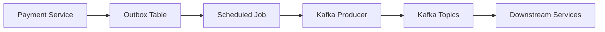
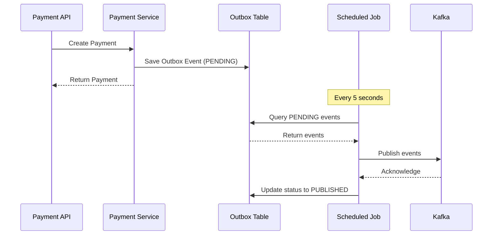
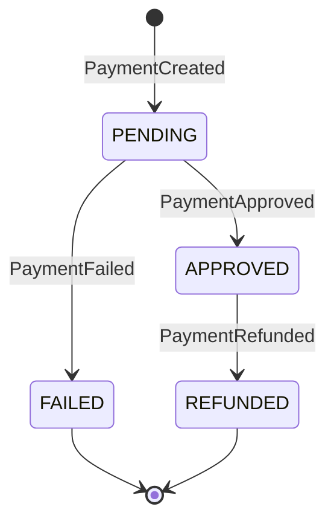
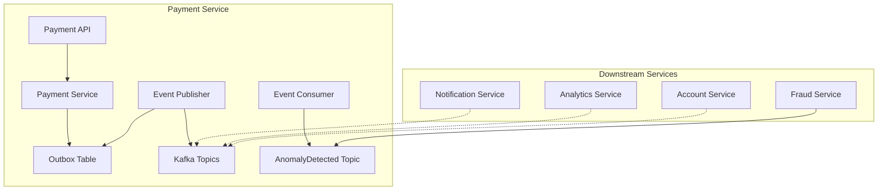

# Payment Service Events Reference

## Overview

The Payment Service implements an event-driven architecture using Apache Kafka for inter-service communication. This document provides detailed information about all events published and consumed by the Payment Service, including their schemas, when they are triggered, and how they are handled.

## Event Architecture

The Payment Service uses the **Outbox Pattern** for reliable event publishing. Events are first stored in the `outbox_events` table and then periodically published to Kafka by a scheduled job. This ensures that events are not lost even if Kafka is temporarily unavailable.



## Published Events

### 1. PaymentCreated

#### Event Name
`PaymentCreated`

#### Topic
`payment-created`

#### Description
Emitted when a new payment is created. This event signals to downstream services that a payment transaction has been initiated and is awaiting approval.

#### When Published
- Immediately after a payment is successfully created via the `POST /payments` endpoint
- The payment is saved to the database with status `PENDING`
- The event is stored in the outbox table and published by the scheduled job

#### Consumers
- **Notification Service**: Sends confirmation to the payer
- **Analytics Service**: Records payment creation for analytics
- **Fraud Service**: Analyzes the payment for potential fraud

#### Event Schema

```json
{
  "eventType": "PaymentCreated",
  "paymentId": "string (UUID)",
  "fromAccountId": "string (UUID)",
  "toAccountId": "string (UUID)",
  "amount": "number (BigDecimal)",
  "currency": "string (ISO 4217)",
  "timestamp": "string (ISO 8601)"
}
```

| Field | Type | Description |
|-------|------|-------------|
| `eventType` | string | Event type identifier (always "PaymentCreated") |
| `paymentId` | UUID | Unique identifier of the payment |
| `fromAccountId` | UUID | Source account ID |
| `toAccountId` | UUID | Destination account ID |
| `amount` | BigDecimal | Payment amount |
| `currency` | string | Currency code (ISO 4217) |
| `timestamp` | string | Event creation timestamp (ISO 8601) |

#### Example Payload

```json
{
  "eventType": "PaymentCreated",
  "paymentId": "323e4567-e89b-12d3-a456-426614174002",
  "fromAccountId": "123e4567-e89b-12d3-a456-426614174000",
  "toAccountId": "223e4567-e89b-12d3-a456-426614174001",
  "amount": 100.50,
  "currency": "USD",
  "timestamp": "2024-01-15T10:30:00Z"
}
```

#### Java Event Class

```java
@Data
@Builder
@NoArgsConstructor
@AllArgsConstructor
public class PaymentCreatedEvent {
    private String eventType = "PaymentCreated";
    private UUID paymentId;
    private UUID fromAccountId;
    private UUID toAccountId;
    private BigDecimal amount;
    private String currency;
    private Instant timestamp = Instant.now();
}
```

---

### 2. PaymentApproved

#### Event Name
`PaymentApproved`

#### Topic
`payment-approved`

#### Description
Emitted when a payment is approved. This event signals that the payment has been successfully processed and funds should be transferred.

#### When Published
- Immediately after a payment is successfully approved via the `PUT /payments/{id}/approve` endpoint
- The payment status is updated to `APPROVED`
- The event is stored in the outbox table and published by the scheduled job

#### Consumers
- **Notification Service**: Sends approval notification to both payer and payee
- **Analytics Service**: Records payment approval for analytics
- **Account Service**: Updates account balances

#### Event Schema

```json
{
  "eventType": "PaymentApproved",
  "paymentId": "string (UUID)",
  "status": "string (PaymentStatus)",
  "timestamp": "string (ISO 8601)"
}
```

| Field | Type | Description |
|-------|------|-------------|
| `eventType` | string | Event type identifier (always "PaymentApproved") |
| `paymentId` | UUID | Unique identifier of the payment |
| `status` | string | Payment status (always "APPROVED") |
| `timestamp` | string | Event creation timestamp (ISO 8601) |

#### Example Payload

```json
{
  "eventType": "PaymentApproved",
  "paymentId": "323e4567-e89b-12d3-a456-426614174002",
  "status": "APPROVED",
  "timestamp": "2024-01-15T10:35:00Z"
}
```

#### Java Event Class

```java
@Data
@Builder
@NoArgsConstructor
@AllArgsConstructor
public class PaymentApprovedEvent {
    private String eventType = "PaymentApproved";
    private UUID paymentId;
    private PaymentStatus status = PaymentStatus.APPROVED;
    private Instant timestamp = Instant.now();
}
```

---

### 3. PaymentFailed

#### Event Name
`PaymentFailed`

#### Topic
`payment-failed`

#### Description
Emitted when a payment fails. This event signals that the payment could not be completed and provides the reason for failure.

#### When Published
- Immediately after a payment is failed via the `PUT /payments/{id}/fail` endpoint
- The payment status is updated to `FAILED` with a failure reason
- The event is stored in the outbox table and published by the scheduled job

#### Consumers
- **Notification Service**: Sends failure notification to the payer
- **Analytics Service**: Records payment failure for analytics
- **Support Service**: May trigger support ticket creation

#### Event Schema

```json
{
  "eventType": "PaymentFailed",
  "paymentId": "string (UUID)",
  "reason": "string",
  "timestamp": "string (ISO 8601)"
}
```

| Field | Type | Description |
|-------|------|-------------|
| `eventType` | string | Event type identifier (always "PaymentFailed") |
| `paymentId` | UUID | Unique identifier of the payment |
| `reason` | string | Reason for payment failure |
| `timestamp` | string | Event creation timestamp (ISO 8601) |

#### Example Payload

```json
{
  "eventType": "PaymentFailed",
  "paymentId": "323e4567-e89b-12d3-a456-426614174002",
  "reason": "Insufficient funds",
  "timestamp": "2024-01-15T10:35:00Z"
}
```

#### Java Event Class

```java
@Data
@Builder
@NoArgsConstructor
@AllArgsConstructor
public class PaymentFailedEvent {
    private String eventType = "PaymentFailed";
    private UUID paymentId;
    private String reason;
    private Instant timestamp = Instant.now();
}
```

---

### 4. PaymentRefunded

#### Event Name
`PaymentRefunded`

#### Topic
`payment-refunded`

#### Description
Emitted when a payment is refunded. This event signals that a previously approved payment has been refunded.

#### When Published
- Immediately after a payment is refunded via the `POST /payments/{id}/refund` endpoint
- The payment status is updated to `REFUNDED` with a refund amount
- The event is stored in the outbox table and published by the scheduled job

#### Consumers
- **Notification Service**: Sends refund notification to the payer
- **Analytics Service**: Records payment refund for analytics
- **Account Service**: Reverses the original balance transfer

#### Event Schema

```json
{
  "eventType": "PaymentRefunded",
  "paymentId": "string (UUID)",
  "refundAmount": "number (BigDecimal)",
  "timestamp": "string (ISO 8601)"
}
```

| Field | Type | Description |
|-------|------|-------------|
| `eventType` | string | Event type identifier (always "PaymentRefunded") |
| `paymentId` | UUID | Unique identifier of the payment |
| `refundAmount` | BigDecimal | Amount that was refunded |
| `timestamp` | string | Event creation timestamp (ISO 8601) |

#### Example Payload

```json
{
  "eventType": "PaymentRefunded",
  "paymentId": "323e4567-e89b-12d3-a456-426614174002",
  "refundAmount": 100.50,
  "timestamp": "2024-01-15T10:40:00Z"
}
```

#### Java Event Class

```java
@Data
@Builder
@NoArgsConstructor
@AllArgsConstructor
public class PaymentRefundedEvent {
    private String eventType = "PaymentRefunded";
    private UUID paymentId;
    private BigDecimal refundAmount;
    private Instant timestamp = Instant.now();
}
```

---

## Consumed Events

### 1. AnomalyDetected

#### Event Name
`AnomalyDetected`

#### Topic
`anomaly-detected`

#### Description
Consumed when the Fraud Service detects suspicious activity related to a payment. This event allows the Payment Service to be aware of potential fraud for monitoring purposes.

#### How Handled
The Payment Service consumes this event via the `EventConsumerService`:
- The event is logged with the payment ID and risk score
- Currently, the service only logs the event for monitoring
- In a production environment, this could trigger automatic payment failure or manual review

#### Event Schema

```json
{
  "eventType": "AnomalyDetected",
  "paymentId": "string (UUID)",
  "riskScore": "number (double)",
  "message": "string",
  "timestamp": "string (ISO 8601)"
}
```

| Field | Type | Description |
|-------|------|-------------|
| `eventType` | string | Event type identifier (always "AnomalyDetected") |
| `paymentId` | UUID | Unique identifier of the payment |
| `riskScore` | double | Risk score calculated by the fraud service |
| `message` | string | Description of the anomaly detected |
| `timestamp` | string | Event creation timestamp (ISO 8601) |

#### Example Payload

```json
{
  "eventType": "AnomalyDetected",
  "paymentId": "323e4567-e89b-12d3-a456-426614174002",
  "riskScore": 0.85,
  "message": "Unusual payment pattern detected",
  "timestamp": "2024-01-15T10:32:00Z"
}
```

#### Java Event Class

```java
@Data
@Builder
@NoArgsConstructor
@AllArgsConstructor
public class AnomalyDetectedEvent {
    private String eventType = "AnomalyDetected";
    private UUID paymentId;
    private double riskScore;
    private String message;
    private Instant timestamp = Instant.now();
}
```

#### Consumer Implementation

```java
@Service
public class EventConsumerService {

    private static final Logger logger = LoggerFactory.getLogger(EventConsumerService.class);
    private final ObjectMapper objectMapper;

    @KafkaListener(topics = "anomaly-detected", groupId = "payment-service-group")
    public void consumeAnomalyDetected(String message) {
        try {
            AnomalyDetectedEvent event = objectMapper.readValue(message, AnomalyDetectedEvent.class);
            logger.info("Received AnomalyDetected event for paymentId: {}, riskScore: {}",
                    event.getPaymentId(), event.getRiskScore());
            // Handle anomaly - payment will be failed by fraud service
        } catch (Exception e) {
            logger.error("Failed to process AnomalyDetected event: {}", message, e);
        }
    }
}
```

---

## Outbox Pattern

The Payment Service uses the Outbox Pattern to ensure reliable event publishing. Here's how it works:

### Outbox Event Flow



### Outbox Event Entity

```java
@Entity
@Table(name = "outbox_events")
public class OutboxEvent {
    private UUID id;
    private UUID aggregateId;
    private String aggregateType;
    private String eventType;
    private String payload;
    private OutboxStatus status;
    private Instant createdAt;
    private Instant processedAt;
    private int retryCount;
    private String errorMessage;
}
```

### Outbox Status Values

| Status | Description |
|--------|-------------|
| `PENDING` | Event is waiting to be published |
| `PUBLISHED` | Event has been successfully published |
| `FAILED` | Event publication failed after max retries |

### Event Publishing Configuration

```yaml
payment-service:
  outbox:
    enabled: true
    poll-interval: 5000    # 5 seconds
    max-retries: 3
```

### Scheduled Job

The `EventPublisherService` runs a scheduled job every 5 seconds to process pending outbox events:

```java
@Scheduled(fixedDelay = 5000)
public void processOutboxEvents() {
    List<OutboxEvent> pendingEvents = outboxRepository
            .findByStatus(OutboxStatus.PENDING, PageRequest.of(0, 100))
            .getContent();

    for (OutboxEvent event : pendingEvents) {
        try {
            String topic = getTopicForEventType(event.getEventType());
            kafkaTemplate.send(topic, event.getAggregateId().toString(), event.getPayload());

            event.setStatus(OutboxStatus.PUBLISHED);
            event.setProcessedAt(Instant.now());
            outboxRepository.save(event);
        } catch (Exception e) {
            event.setRetryCount(event.getRetryCount() + 1);
            event.setErrorMessage(e.getMessage());

            if (event.getRetryCount() >= 3) {
                event.setStatus(OutboxStatus.FAILED);
            }
            outboxRepository.save(event);
        }
    }
}
```

---

## Event Topic Mapping

| Event Type | Kafka Topic |
|------------|-------------|
| `PaymentCreated` | `payment-created` |
| `PaymentApproved` | `payment-approved` |
| `PaymentFailed` | `payment-failed` |
| `PaymentRefunded` | `payment-refunded` |

---

## Event Ordering and Guarantees

### Ordering
- Events for the same payment ID are published in the order they occur
- The outbox pattern ensures at-least-once delivery semantics

### Guarantees
- **At-least-once delivery**: Events may be delivered multiple times
- **Eventual consistency**: Events are published asynchronously
- **No event loss**: Failed events are stored in the outbox table for manual inspection

---

## Kafka Configuration

### Producer Configuration

```yaml
spring:
  kafka:
    producer:
      key-serializer: org.apache.kafka.common.serialization.StringSerializer
      value-serializer: org.apache.kafka.common.serialization.StringSerializer
      acks: all
      retries: 3
```

### Consumer Configuration

```yaml
spring:
  kafka:
    consumer:
      key-deserializer: org.apache.kafka.common.serialization.StringDeserializer
      value-deserializer: org.apache.kafka.common.serialization.StringDeserializer
      auto-offset-reset: earliest
      enable-auto-commit: false
```

---

## Event Testing

### Publishing Events

To test event publishing, you can use Kafka CLI tools:

```bash
# Consume from a topic
kafka-console-consumer --bootstrap-server localhost:9092 \
  --topic payment-created \
  --from-beginning
```

### Consuming Events

To test event consumption, you can publish test events:

```bash
# Publish to a topic
kafka-console-producer --bootstrap-server localhost:9092 \
  --topic anomaly-detected

# Then paste the JSON payload
{
  "eventType": "AnomalyDetected",
  "paymentId": "323e4567-e89b-12d3-a456-426614174002",
  "riskScore": 0.85,
  "message": "Test anomaly",
  "timestamp": "2024-01-15T10:32:00Z"
}
```

---

## Event Diagrams

### Payment Lifecycle Events



### Event Flow Architecture



---

## Related Documentation

- [Payment Service Documentation](./payment-service.md) - Main service documentation
- [Payment Service API Reference](./payment-service-api.md) - API endpoint documentation
- [Events Documentation](./events.md) - Platform-wide event catalog
- [Architecture Overview](./architecture.md) - System-wide architecture documentation
