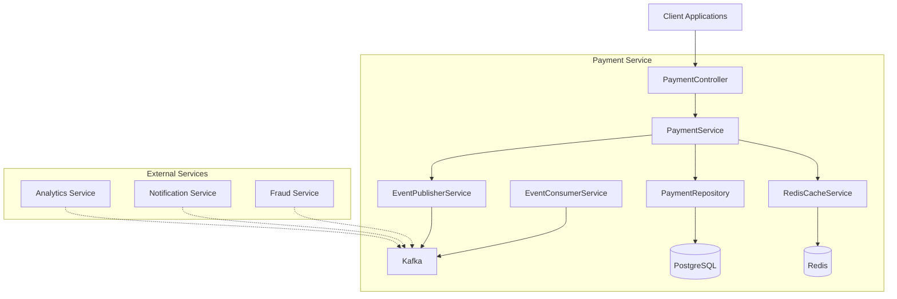
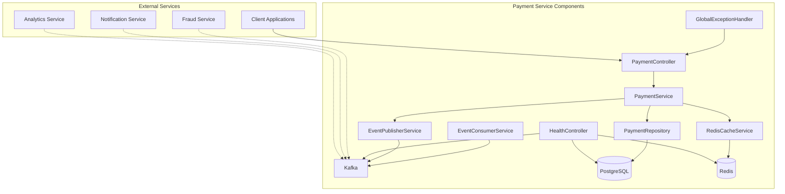
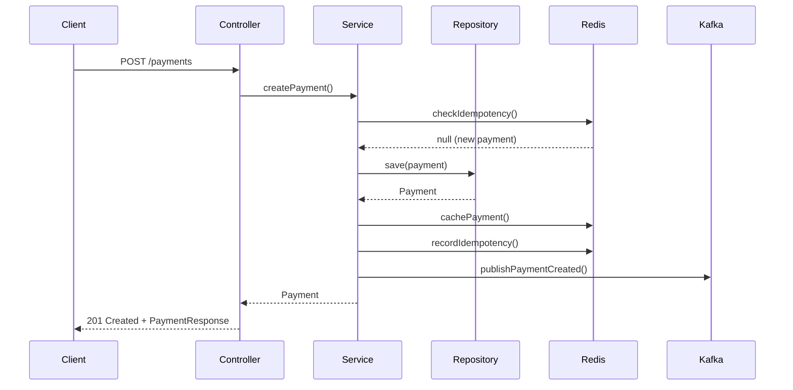
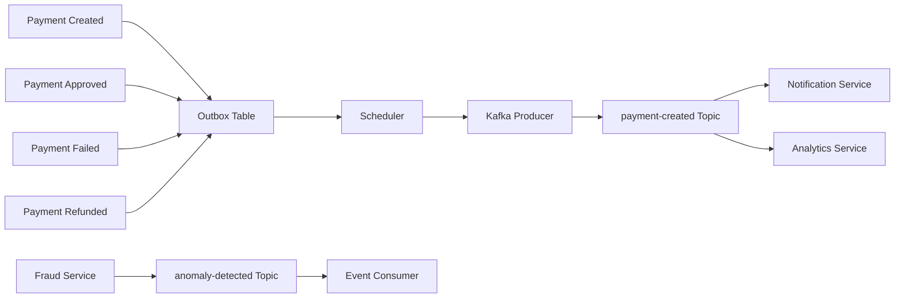
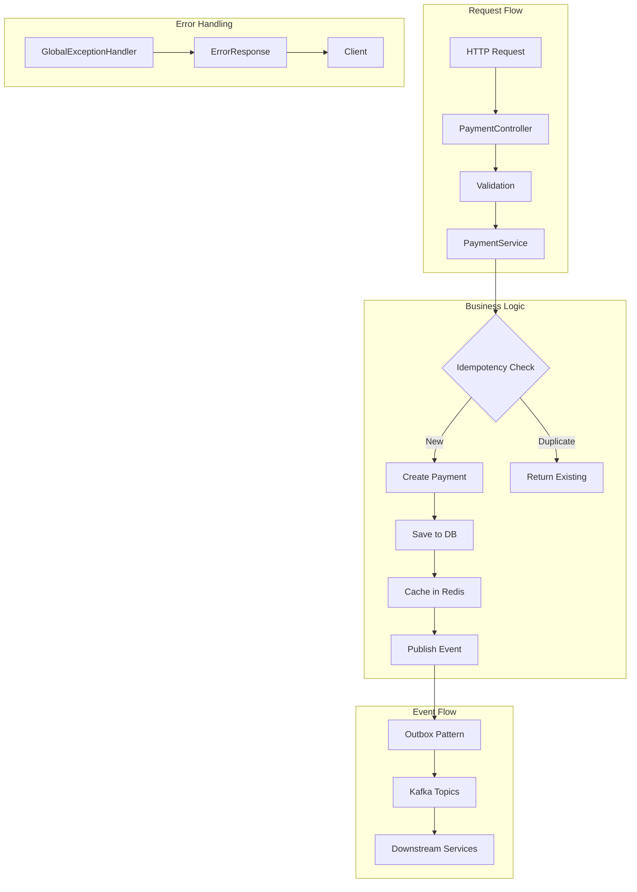

# Payment Service Documentation

## Overview

The Payment Service is a core component of the RamPay platform responsible for managing payment transactions. It provides a comprehensive REST API for creating, querying, approving, failing, and refunding payments. The service implements an event-driven architecture using Apache Kafka for inter-service communication, Redis for caching and idempotency, and PostgreSQL for persistent storage.

### Service Purpose and Responsibilities

The Payment Service is responsible for:

- **Payment Lifecycle Management**: Create, approve, fail, and refund payments
- **Payment Querying**: Retrieve payments by ID, account, or status with pagination support
- **Event Publishing**: Emit payment lifecycle events to Kafka for downstream services
- **Event Consumption**: Process anomaly detection events from the fraud service
- **Idempotency**: Ensure payment operations are idempotent using Redis
- **Caching**: Improve performance with Redis caching for frequently accessed payments
- **Validation**: Enforce business rules and validate payment requests

### Technology Stack

| Technology | Purpose | Version |
|------------|---------|---------|
| Java | Programming Language | 25 |
| Spring Boot | Application Framework | 3.5.7 |
| Spring Data JPA | Database ORM | 3.5.7 |
| PostgreSQL | Primary Database | - |
| Redis | Caching & Idempotency | - |
| Apache Kafka | Event Streaming | - |
| OpenTelemetry | Observability | - |
| Lombok | Code Generation | - |
| Maven | Build Tool | - |

### Architecture Overview



### Key Features

- **Complete CRUD Operations**: Create, read, update (approve/fail/refund), and query payments
- **Pagination Support**: Efficient retrieval of large datasets with configurable page sizes
- **Event-Driven Architecture**: Outbox pattern for reliable event publishing
- **Idempotency**: Prevent duplicate payment processing using idempotency keys
- **Caching Strategy**: Redis caching with configurable TTL values
- **Comprehensive Validation**: Request validation with custom validators
- **Error Handling**: Centralized exception handling with consistent error responses
- **Observability**: OpenTelemetry integration for distributed tracing
- **Health Checks**: Comprehensive health check endpoint for database, Redis, and Kafka

---

## API Reference

### Base URL

```
http://localhost:8080
```

### Endpoints Overview

| Method | Path | Description |
|--------|------|-------------|
| POST | `/payments` | Create a new payment |
| GET | `/payments` | Get all payments (paginated) |
| GET | `/payments/{id}` | Get payment by ID |
| PUT | `/payments/{id}/approve` | Approve a payment |
| PUT | `/payments/{id}/fail` | Fail a payment |
| POST | `/payments/{id}/refund` | Refund a payment |
| GET | `/payments/account/{accountId}` | Get payments by account |
| GET | `/payments/status/{status}` | Get payments by status |
| GET | `/health` | Health check |

For detailed API documentation, see [Payment Service API Reference](./payment-service-api.md).

---

## Event Reference

### Published Events

The Payment Service publishes the following events to Kafka:

| Event | Topic | Description |
|-------|-------|-------------|
| PaymentCreated | `payment-created` | Emitted when a new payment is created |
| PaymentApproved | `payment-approved` | Emitted when a payment is approved |
| PaymentFailed | `payment-failed` | Emitted when a payment fails |
| PaymentRefunded | `payment-refunded` | Emitted when a payment is refunded |

### Consumed Events

The Payment Service consumes the following events from Kafka:

| Event | Topic | Description |
|-------|-------|-------------|
| AnomalyDetected | `anomaly-detected` | Consumed when fraud is detected for a payment |

For detailed event documentation, see [Payment Service Events Reference](./payment-service-events.md).

---

## Configuration

### Application Configuration

The Payment Service uses Spring Boot's configuration system with support for environment variables and profile-based configuration.

### Environment Variables

| Variable | Description | Default |
|----------|-------------|---------|
| `SPRING_PROFILES_ACTIVE` | Active Spring profile | `dev` |
| `DB_URL` | PostgreSQL JDBC URL | `jdbc:postgresql://localhost:5432/rampaydb` |
| `DB_USERNAME` | Database username | `rampay` |
| `DB_PASSWORD` | Database password | `rampay` |
| `REDIS_HOST` | Redis host | `localhost` |
| `REDIS_PORT` | Redis port | `6379` |
| `REDIS_PASSWORD` | Redis password | (empty) |
| `KAFKA_BOOTSTRAP_SERVERS` | Kafka bootstrap servers | `localhost:9092` |
| `SERVER_PORT` | HTTP server port | `8080` |
| `JPA_DDL_AUTO` | JPA DDL mode | `update` |
| `JPA_SHOW_SQL` | Show SQL in logs | `false` |
| `OTEL_EXPORTER_OTLP_ENDPOINT` | OpenTelemetry endpoint | `http://localhost:4317` |

### Profile-Based Configuration

The service supports multiple profiles for different environments:

- **dev**: Development environment with local services
- **test**: Testing environment
- **prod**: Production environment with hardened configuration

### Kafka Configuration

```yaml
spring:
  kafka:
    bootstrap-servers: ${KAFKA_BOOTSTRAP_SERVERS:localhost:9092}
    producer:
      key-serializer: org.apache.kafka.common.serialization.StringSerializer
      value-serializer: org.apache.kafka.common.serialization.StringSerializer
      acks: all
      retries: 3
    consumer:
      key-deserializer: org.apache.kafka.common.serialization.StringDeserializer
      value-deserializer: org.apache.kafka.common.serialization.StringDeserializer
      auto-offset-reset: earliest
      enable-auto-commit: false
```

### Redis Configuration

```yaml
spring:
  data:
    redis:
      host: ${REDIS_HOST:localhost}
      port: ${REDIS_PORT:6379}
      password: ${REDIS_PASSWORD:}
```

### Database Configuration

```yaml
spring:
  datasource:
    url: ${DB_URL:jdbc:postgresql://localhost:5432/rampaydb}
    username: ${DB_USERNAME:rampay}
    password: ${DB_PASSWORD:rampay}
    driver-class-name: org.postgresql.Driver
  jpa:
    hibernate:
      ddl-auto: ${JPA_DDL_AUTO:update}
    show-sql: ${JPA_SHOW_SQL:false}
    properties:
      hibernate:
        dialect: org.hibernate.dialect.PostgreSQLDialect
```

### OpenTelemetry Configuration

```yaml
opentelemetry:
  traces:
    exporter: otlp
    otlp:
      endpoint: ${OTEL_EXPORTER_OTLP_ENDPOINT:http://localhost:4317}
    sampler:
      probability: 1.0
```

### Payment Service Specific Configuration

```yaml
payment-service:
  cache:
    payment-ttl: 3600      # 1 hour
    idempotency-ttl: 86400 # 24 hours
    list-ttl: 300          # 5 minutes
  idempotency:
    enabled: true
    header-name: Idempotency-Key
  outbox:
    enabled: true
    poll-interval: 5000    # 5 seconds
    max-retries: 3
  validation:
    max-amount: 1000000.00
    min-amount: 0.01
```

---

## Data Models

### Payment Entity

| Field | Type | Description | Constraints |
|-------|------|-------------|-------------|
| `id` | UUID | Primary key | Auto-generated |
| `fromAccountId` | UUID | Source account ID | Not null |
| `toAccountId` | UUID | Destination account ID | Not null |
| `amount` | BigDecimal | Payment amount | Not null, precision 19, scale 4 |
| `currency` | String | Currency code (ISO 4217) | Not null, length 3 |
| `status` | PaymentStatus | Payment status | Not null |
| `createdAt` | Instant | Creation timestamp | Auto-generated |
| `updatedAt` | Instant | Last update timestamp | Auto-updated |
| `failureReason` | String | Reason for failure | Optional, max 255 |
| `refundAmount` | BigDecimal | Refund amount | Optional, precision 19, scale 4 |
| `idempotencyKey` | String | Idempotency key | Optional, unique |

### PaymentStatus Enum

| Value | Description |
|-------|-------------|
| `PENDING` | Payment is awaiting approval |
| `APPROVED` | Payment has been approved |
| `FAILED` | Payment has failed |
| `REFUNDED` | Payment has been refunded |

### OutboxEvent Entity

| Field | Type | Description | Constraints |
|-------|------|-------------|-------------|
| `id` | UUID | Primary key | Auto-generated |
| `aggregateId` | UUID | Aggregate root ID | Not null |
| `aggregateType` | String | Aggregate type | Not null, max 50 |
| `eventType` | String | Event type | Not null, max 100 |
| `payload` | String | Event payload (JSON) | Not null, TEXT |
| `status` | OutboxStatus | Event status | Not null |
| `createdAt` | Instant | Creation timestamp | Auto-generated |
| `processedAt` | Instant | Processing timestamp | Optional |
| `retryCount` | int | Number of retries | Default 0 |
| `errorMessage` | String | Error message | Optional, TEXT |

### OutboxStatus Enum

| Value | Description |
|-------|-------------|
| `PENDING` | Event is pending publication |
| `PUBLISHED` | Event has been published |
| `FAILED` | Event publication failed |

### DTOs

#### CreatePaymentRequest

| Field | Type | Description | Validation |
|-------|------|-------------|-----------|
| `fromAccountId` | UUID | Source account ID | Required |
| `toAccountId` | UUID | Destination account ID | Required, must differ from fromAccountId |
| `amount` | BigDecimal | Payment amount | Required, min 0.01, max 1,000,000.00 |
| `currency` | String | Currency code | Required, ISO 4217 format |

#### PaymentResponse

| Field | Type | Description |
|-------|------|-------------|
| `id` | UUID | Payment ID |
| `fromAccountId` | UUID | Source account ID |
| `toAccountId` | UUID | Destination account ID |
| `amount` | BigDecimal | Payment amount |
| `currency` | String | Currency code |
| `status` | PaymentStatus | Payment status |
| `createdAt` | Instant | Creation timestamp |
| `updatedAt` | Instant | Last update timestamp |
| `failureReason` | String | Reason for failure (if applicable) |
| `refundAmount` | BigDecimal | Refund amount (if applicable) |

#### FailPaymentRequest

| Field | Type | Description | Validation |
|-------|------|-------------|-----------|
| `reason` | String | Failure reason | Required, max 255 characters |

#### RefundPaymentRequest

| Field | Type | Description | Validation |
|-------|------|-------------|-----------|
| `refundAmount` | BigDecimal | Refund amount | Required, min 0.01 |

#### ErrorResponse

| Field | Type | Description |
|-------|------|-------------|
| `timestamp` | Instant | Error timestamp |
| `status` | int | HTTP status code |
| `error` | String | Error type |
| `message` | String | Error message |
| `path` | String | Request path |
| `details` | List<String> | Additional error details |

---

## Error Handling

### Custom Exceptions

| Exception | HTTP Status | Description |
|-----------|-------------|-------------|
| `PaymentNotFoundException` | 404 | Payment not found |
| `DuplicatePaymentException` | 409 | Duplicate payment detected |
| `InvalidPaymentStatusException` | 400 | Invalid payment status for operation |
| `InvalidPaymentAmountException` | 400 | Invalid payment amount |
| `InsufficientFundsException` | 400 | Insufficient funds for payment |
| `EventPublishingException` | 500 | Failed to publish event |

### Error Response Format

```json
{
  "timestamp": "2024-01-01T00:00:00Z",
  "status": 404,
  "error": "Not Found",
  "message": "Payment not found with id: 123e4567-e89b-12d3-a456-426614174000",
  "path": "/payments/123e4567-e89b-12d3-a456-426614174000",
  "details": []
}
```

### Validation Error Response

```json
{
  "timestamp": "2024-01-01T00:00:00Z",
  "status": 400,
  "error": "Validation Error",
  "message": "Request validation failed",
  "path": "/payments",
  "details": [
    "amount: amount must be greater than 0",
    "currency: currency must be a valid ISO 4217 code"
  ]
}
```

---

## Idempotency

### How Idempotency Works

The Payment Service implements idempotency using Redis to ensure that the same payment request with the same idempotency key is processed only once. This prevents duplicate payments and ensures consistent results even in the face of network retries.

### Idempotency Key Usage

To use idempotency, include the `Idempotency-Key` header in your POST request:

```http
POST /payments
Idempotency-Key: unique-key-12345
Content-Type: application/json
```

When a request with an idempotency key is received:

1. The service checks Redis for an existing payment with this key
2. If found, it returns a `409 Conflict` response indicating the payment was already processed
3. If not found, the payment is created and the idempotency key is stored in Redis

### Redis Caching Strategy

| Key Pattern | Purpose | TTL |
|-------------|---------|-----|
| `payment:{id}` | Payment cache | 1 hour (3600s) |
| `idempotency:{key}` | Idempotency key | 24 hours (86400s) |

---

## Caching Strategy

### What Data is Cached

- **Payment entities**: Individual payments are cached after retrieval or creation
- **Idempotency keys**: Idempotency keys are cached to prevent duplicate processing

### Cache Keys

| Key Pattern | Example |
|-------------|---------|
| `payment:{id}` | `payment:123e4567-e89b-12d3-a456-426614174000` |
| `idempotency:{key}` | `idempotency:unique-key-12345` |

### TTL Values

| Cache Type | TTL | Reason |
|------------|-----|--------|
| Payment | 1 hour | Balance between freshness and performance |
| Idempotency | 24 hours | Prevent duplicate processing for a full day |

### Cache Invalidation

Cache invalidation occurs automatically through TTL expiration. The cache is updated whenever a payment is modified:

- After payment creation
- After payment approval
- After payment failure
- After payment refund

---

## Testing

### Test Structure

The Payment Service has comprehensive test coverage with 150+ test cases organized as follows:

```
src/test/java/com/rampay/paymentservice/
├── PaymentServiceApplicationTests.java    # Application context tests
├── config/
│   └── TestConfig.java                    # Test configuration
├── controllers/
│   ├── HealthControllerTest.java         # Health endpoint tests
│   └── PaymentControllerTest.java        # Payment API tests
├── handlers/
│   └── GlobalExceptionHandlerTest.java   # Exception handling tests
├── repositories/
│   ├── OutboxRepositoryTest.java         # Outbox repository tests
│   └── PaymentRepositoryTest.java        # Payment repository tests
├── services/
│   ├── EventConsumerServiceTest.java      # Event consumer tests
│   ├── EventPublisherServiceTest.java    # Event publisher tests
│   ├── PaymentServiceTest.java           # Payment service tests
│   └── RedisCacheServiceTest.java        # Redis cache tests
└── validators/
    └── CurrencyValidatorTest.java        # Currency validation tests
```

### How to Run Tests

Run all tests:

```bash
cd services/payment-service
./mvnw test
```

Run specific test class:

```bash
./mvnw test -Dtest=PaymentServiceTest
```

Run tests with coverage:

```bash
./mvnw test jacoco:report
```

### Test Coverage

The Payment Service maintains high test coverage across all layers:

- **Controller Layer**: API endpoint testing
- **Service Layer**: Business logic testing
- **Repository Layer**: Data access testing
- **Integration Tests**: End-to-end testing with embedded services

---

## Deployment

### Docker Setup

The Payment Service can be deployed using Docker. A Dockerfile should be created in the service directory:

```dockerfile
FROM openjdk:25-slim
WORKDIR /app
COPY target/payment-service-0.0.1-SNAPSHOT.jar app.jar
EXPOSE 8080
ENTRYPOINT ["java", "-jar", "app.jar"]
```

Build the Docker image:

```bash
cd services/payment-service
./mvnw clean package
docker build -t rampay/payment-service:latest .
```

### Docker Compose Usage

The Payment Service is included in the main Docker Compose setup. See [`infra/docker-compose.yml`](../infra/docker-compose.yml) for the complete configuration.

To start all services:

```bash
docker-compose up -d
```

To start only the Payment Service and its dependencies:

```bash
docker-compose up -d postgres redis kafka payment-service
```

### Environment Setup

For local development, ensure the following services are running:

1. **PostgreSQL**: Database server on port 5432
2. **Redis**: Cache server on port 6379
3. **Kafka**: Event streaming platform on port 9092

Using Docker Compose:

```bash
cd infra
docker-compose up -d postgres redis kafka zookeeper
```

Then start the Payment Service:

```bash
cd services/payment-service
./mvnw spring-boot:run
```

---

## Architecture Diagrams

### Service Architecture



### Data Flow



### Event Flow



### Component Interaction



---

## Related Documentation

- [Payment Service API Reference](./payment-service-api.md) - Detailed API endpoint documentation
- [Payment Service Events Reference](./payment-service-events.md) - Event schema and usage documentation
- [Payment Service Design](./payment-service-design.md) - Design decisions and architecture
- [Architecture Overview](./architecture.md) - System-wide architecture documentation
- [Events Documentation](./events.md) - Platform-wide event catalog
