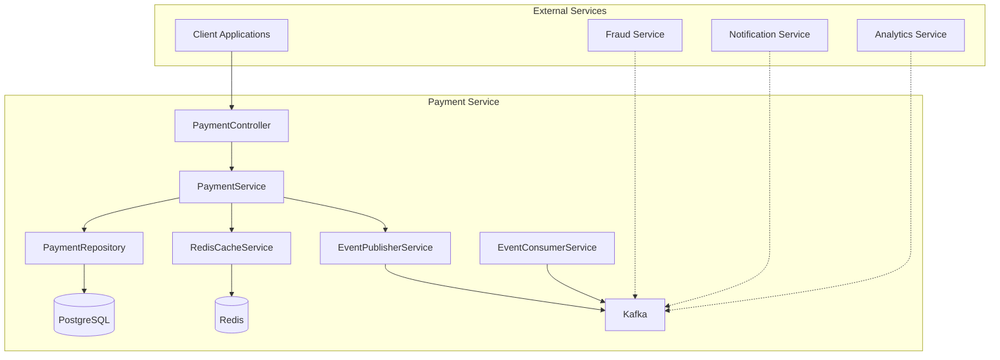

# Payment Service

The Payment Service is a core component of the RamPay platform responsible for managing payment transactions. It provides a comprehensive REST API for creating, querying, approving, failing, and refunding payments with full event-driven architecture support.

## Table of Contents

- [Overview](#overview)
- [Features](#features)
- [Technology Stack](#technology-stack)
- [Prerequisites](#prerequisites)
- [Quick Start](#quick-start)
- [Running the Service](#running-the-service)
- [Running Tests](#running-tests)
- [API Documentation](#api-documentation)
- [Configuration](#configuration)
- [Architecture](#architecture)
- [Troubleshooting](#troubleshooting)

## Overview

The Payment Service is responsible for:

- **Payment Lifecycle Management**: Create, approve, fail, and refund payments
- **Payment Querying**: Retrieve payments by ID, account, or status with pagination
- **Event Publishing**: Emit payment lifecycle events to Kafka
- **Event Consumption**: Process anomaly detection events from the fraud service
- **Idempotency**: Ensure payment operations are idempotent using Redis
- **Caching**: Improve performance with Redis caching
- **Validation**: Enforce business rules and validate payment requests

## Features

- ✅ Complete CRUD operations with pagination
- ✅ Event-driven architecture with Kafka integration
- ✅ Outbox pattern for reliable event publishing
- ✅ Idempotency support via Redis
- ✅ Redis caching for improved performance
- ✅ Comprehensive validation and error handling
- ✅ OpenTelemetry integration for observability
- ✅ Health check endpoint for monitoring
- ✅ 150+ test cases with high coverage

## Technology Stack

| Technology | Version | Purpose |
|------------|---------|---------|
| Java | 25 | Programming Language |
| Spring Boot | 3.5.7 | Application Framework |
| Spring Data JPA | 3.5.7 | Database ORM |
| PostgreSQL | Latest | Primary Database |
| Redis | Latest | Caching & Idempotency |
| Apache Kafka | Latest | Event Streaming |
| OpenTelemetry | Latest | Observability |
| Lombok | Latest | Code Generation |
| Maven | Latest | Build Tool |

## Prerequisites

Before running the Payment Service, ensure you have the following installed:

- **Java 25** or higher
- **Maven 3.8+** or higher
- **PostgreSQL 15+** or higher
- **Redis 7+** or higher
- **Apache Kafka 3+** or higher
- **Docker** (optional, for containerized deployment)

### Using Docker Compose

The easiest way to get started is using Docker Compose to run all dependencies:

```bash
cd ../../infra
docker-compose up -d postgres redis kafka zookeeper
```

## Quick Start

### 1. Clone the Repository

```bash
git clone https://github.com/your-org/RamPay.git
cd RamPay/services/payment-service
```

### 2. Start Dependencies

Using Docker Compose:

```bash
cd ../../infra
docker-compose up -d postgres redis kafka zookeeper
```

Or start each service individually:

```bash
# PostgreSQL
docker run -d --name postgres -p 5432:5432 \
  -e POSTGRES_DB=rampaydb \
  -e POSTGRES_USER=rampay \
  -e POSTGRES_PASSWORD=rampay \
  postgres:15

# Redis
docker run -d --name redis -p 6379:6379 redis:7

# Kafka & Zookeeper
docker run -d --name zookeeper -p 2181:2181 \
  -e ZOOKEEPER_CLIENT_PORT=2181 \
  confluentinc/cp-zookeeper:latest

docker run -d --name kafka -p 9092:9092 \
  -e KAFKA_BROKER_ID=1 \
  -e KAFKA_ZOOKEEPER_CONNECT=zookeeper:2181 \
  -e KAFKA_ADVERTISED_LISTENERS=PLAINTEXT://localhost:9092 \
  -e KAFKA_OFFSETS_TOPIC_REPLICATION_FACTOR=1 \
  confluentinc/cp-kafka:latest
```

### 3. Configure the Application

Edit `src/main/resources/application.yaml` or set environment variables:

```bash
export DB_URL=jdbc:postgresql://localhost:5432/rampaydb
export DB_USERNAME=rampay
export DB_PASSWORD=rampay
export REDIS_HOST=localhost
export REDIS_PORT=6379
export KAFKA_BOOTSTRAP_SERVERS=localhost:9092
```

### 4. Build the Application

```bash
./mvnw clean package
```

### 5. Run the Application

```bash
./mvnw spring-boot:run
```

Or run the JAR directly:

```bash
java -jar target/payment-service-0.0.1-SNAPSHOT.jar
```

The service will start on `http://localhost:8080`

## Running the Service

### Development Mode

For development with hot reload:

```bash
./mvnw spring-boot:run
```

### Production Mode

Build and run the JAR:

```bash
./mvnw clean package -DskipTests
java -jar target/payment-service-0.0.1-SNAPSHOT.jar
```

### Using Docker

Build the Docker image:

```bash
docker build -t rampay/payment-service:latest .
```

Run the container:

```bash
docker run -d -p 8080:8080 \
  -e DB_URL=jdbc:postgresql://postgres:5432/rampaydb \
  -e DB_USERNAME=rampay \
  -e DB_PASSWORD=rampay \
  -e REDIS_HOST=redis \
  -e REDIS_PORT=6379 \
  -e KAFKA_BOOTSTRAP_SERVERS=kafka:9092 \
  rampay/payment-service:latest
```

### Using Docker Compose

Start the entire stack:

```bash
cd ../../infra
docker-compose up -d
```

## Running Tests

### Run All Tests

```bash
./mvnw test
```

### Run Specific Test Class

```bash
./mvnw test -Dtest=PaymentServiceTest
```

### Run Tests with Coverage

```bash
./mvnw test jacoco:report
```

The coverage report will be generated in `target/site/jacoco/index.html`

### Test Structure

```
src/test/java/com/rampay/paymentservice/
├── PaymentServiceApplicationTests.java    # Application context tests
├── config/
│   └── TestConfig.java                    # Test configuration
├── controllers/
│   ├── HealthControllerTest.java         # Health endpoint tests
│   └── PaymentControllerTest.java        # Payment API tests
├── handlers/
│   └── GlobalExceptionHandlerTest.java   # Exception handling tests
├── repositories/
│   ├── OutboxRepositoryTest.java         # Outbox repository tests
│   └── PaymentRepositoryTest.java        # Payment repository tests
├── services/
│   ├── EventConsumerServiceTest.java      # Event consumer tests
│   ├── EventPublisherServiceTest.java    # Event publisher tests
│   ├── PaymentServiceTest.java           # Payment service tests
│   └── RedisCacheServiceTest.java        # Redis cache tests
└── validators/
    └── CurrencyValidatorTest.java        # Currency validation tests
```

## API Documentation

### Base URL

```
http://localhost:8080
```

### Endpoints

| Method | Path | Description |
|--------|------|-------------|
| POST | `/payments` | Create a new payment |
| GET | `/payments` | Get all payments (paginated) |
| GET | `/payments/{id}` | Get payment by ID |
| PUT | `/payments/{id}/approve` | Approve a payment |
| PUT | `/payments/{id}/fail` | Fail a payment |
| POST | `/payments/{id}/refund` | Refund a payment |
| GET | `/payments/account/{accountId}` | Get payments by account |
| GET | `/payments/status/{status}` | Get payments by status |
| GET | `/health` | Health check |

### Example: Create a Payment

```bash
curl -X POST http://localhost:8080/payments \
  -H "Content-Type: application/json" \
  -H "Idempotency-Key: unique-key-12345" \
  -d '{
    "fromAccountId": "123e4567-e89b-12d3-a456-426614174000",
    "toAccountId": "223e4567-e89b-12d3-a456-426614174001",
    "amount": 100.50,
    "currency": "USD"
  }'
```

### Example: Get Payment by ID

```bash
curl -X GET http://localhost:8080/payments/323e4567-e89b-12d3-a456-426614174002
```

### Example: Approve a Payment

```bash
curl -X PUT http://localhost:8080/payments/323e4567-e89b-12d3-a456-426614174002/approve
```

### Health Check

```bash
curl -X GET http://localhost:8080/health
```

For detailed API documentation, see [Payment Service API Reference](../../docs/payment-service-api.md).

## Configuration

### Environment Variables

| Variable | Description | Default |
|----------|-------------|---------|
| `SPRING_PROFILES_ACTIVE` | Active Spring profile | `dev` |
| `DB_URL` | PostgreSQL JDBC URL | `jdbc:postgresql://localhost:5432/rampaydb` |
| `DB_USERNAME` | Database username | `rampay` |
| `DB_PASSWORD` | Database password | `rampay` |
| `REDIS_HOST` | Redis host | `localhost` |
| `REDIS_PORT` | Redis port | `6379` |
| `REDIS_PASSWORD` | Redis password | (empty) |
| `KAFKA_BOOTSTRAP_SERVERS` | Kafka bootstrap servers | `localhost:9092` |
| `SERVER_PORT` | HTTP server port | `8080` |
| `JPA_DDL_AUTO` | JPA DDL mode | `update` |
| `JPA_SHOW_SQL` | Show SQL in logs | `false` |
| `OTEL_EXPORTER_OTLP_ENDPOINT` | OpenTelemetry endpoint | `http://localhost:4317` |

### Application Properties

The main configuration file is `src/main/resources/application.yaml`:

```yaml
spring:
  application:
    name: payment-service
  datasource:
    url: ${DB_URL:jdbc:postgresql://localhost:5432/rampaydb}
    username: ${DB_USERNAME:rampay}
    password: ${DB_PASSWORD:rampay}
  data:
    redis:
      host: ${REDIS_HOST:localhost}
      port: ${REDIS_PORT:6379}
  kafka:
    bootstrap-servers: ${KAFKA_BOOTSTRAP_SERVERS:localhost:9092}

payment-service:
  cache:
    payment-ttl: 3600      # 1 hour
    idempotency-ttl: 86400 # 24 hours
  idempotency:
    enabled: true
    header-name: Idempotency-Key
  outbox:
    enabled: true
    poll-interval: 5000    # 5 seconds
    max-retries: 3
```

### Profiles

The service supports multiple profiles:

- **dev**: Development environment with local services
- **test**: Testing environment
- **prod**: Production environment with hardened configuration

Activate a profile:

```bash
./mvnw spring-boot:run -Dspring-boot.run.profiles=prod
```

Or set the environment variable:

```bash
export SPRING_PROFILES_ACTIVE=prod
```

## Architecture

### Service Architecture



### Event Flow

The Payment Service publishes events to Kafka using the Outbox Pattern:

1. Payment operation creates an event
2. Event is saved to the outbox table
3. Scheduled job processes pending events
4. Events are published to Kafka
5. Downstream services consume events

Published events:
- `PaymentCreated` → `payment-created` topic
- `PaymentApproved` → `payment-approved` topic
- `PaymentFailed` → `payment-failed` topic
- `PaymentRefunded` → `payment-refunded` topic

Consumed events:
- `AnomalyDetected` ← `anomaly-detected` topic

For more details, see [Payment Service Documentation](../../docs/payment-service.md) and [Payment Service Events Reference](../../docs/payment-service-events.md).

## Troubleshooting

### Common Issues

#### Service won't start

**Problem**: Service fails to start with database connection error.

**Solution**:
1. Ensure PostgreSQL is running: `docker ps | grep postgres`
2. Check database credentials in `application.yaml`
3. Verify the database exists: `docker exec -it postgres psql -U rampay -d rampaydb`

#### Redis connection refused

**Problem**: Service fails to connect to Redis.

**Solution**:
1. Ensure Redis is running: `docker ps | grep redis`
2. Check Redis host and port configuration
3. Test Redis connection: `redis-cli ping`

#### Kafka connection issues

**Problem**: Events are not being published to Kafka.

**Solution**:
1. Ensure Kafka is running: `docker ps | grep kafka`
2. Check Kafka bootstrap servers configuration
3. Verify topics exist: `kafka-topics --list --bootstrap-server localhost:9092`

#### Idempotency not working

**Problem**: Duplicate payments are being created.

**Solution**:
1. Ensure Redis is running and accessible
2. Check that the `Idempotency-Key` header is being sent
3. Verify idempotency is enabled in configuration

### Logs

Check application logs for detailed error messages:

```bash
# If running with Maven
./mvnw spring-boot:run

# If running JAR directly
java -jar target/payment-service-0.0.1-SNAPSHOT.jar
```

### Health Check

Check service health:

```bash
curl http://localhost:8080/health
```

Expected response:

```json
{
  "status": "UP",
  "database": {
    "status": "UP"
  },
  "redis": {
    "status": "UP"
  },
  "kafka": {
    "status": "UP"
  }
}
```

### Debug Mode

Enable debug logging:

```bash
./mvnw spring-boot:run -Dlogging.level.com.rampay.paymentservice=DEBUG
```

Or add to `application.yaml`:

```yaml
logging:
  level:
    com.rampay.paymentservice: DEBUG
```

## Additional Resources

- [Payment Service Documentation](../../docs/payment-service.md) - Comprehensive service documentation
- [Payment Service API Reference](../../docs/payment-service-api.md) - Detailed API documentation
- [Payment Service Events Reference](../../docs/payment-service-events.md) - Event schema and usage
- [Payment Service Design](../../docs/payment-service-design.md) - Design decisions and architecture
- [Architecture Overview](../../docs/architecture.md) - System-wide architecture documentation
- [Events Documentation](../../docs/events.md) - Platform-wide event catalog

## License

This project is part of the RamPay platform. See the main project LICENSE file for details.
